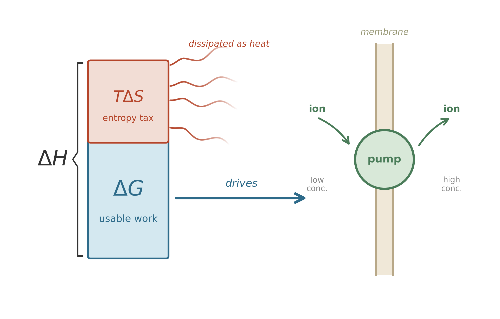

2.8 kilometers below the surface of South Africa, in rock sealed off from sunlight for perhaps twenty million years, a bacterium called *Candidatus* Desulforudis audaxviator may divide as rarely as once per century. Its energy source is hydrogen gas, produced atom by atom as uranium in the surrounding rock decays. Its electron acceptor is sulfate, trapped in mineral inclusions since the Archean. The reaction releases just enough free energy to synthesize a handful of ATP molecules -- just barely enough to copy a genome, repair a membrane, and divide.[^lin2006_deep]

This organism matters because it strips the problem to its minimum. No sunlight. No plants. No food web. Just a vanishingly small chemical gradient and a cell living on it. If you want to understand how microbes built the world, you can start here, with a question so narrow it becomes universal: how little energy can life survive on?

The question does require physics, but not the full lecture course. You only need three ideas.

First: a reaction must actually pay. It must release usable free energy under the conditions where the cell lives, not under imaginary textbook conditions. Second: a favorable reaction can still be too slow to matter unless an enzyme lowers the barrier. Third: the local environment -- the concentrations of reactants and products, the temperature, the pH -- changes the arithmetic continuously. The same metabolism that works in one pore can fail in the next.

Erwin Schrödinger saw the problem early.[^schrodinger1944][^schrodinger_lectures] In 1943, he asked what physical rules a living system must obey simply to persist. His answer was austere and still correct: life does not evade thermodynamics. It survives by obeying thermodynamics in a way that keeps its own internal order from collapsing. A cell stays organized only by spending energy and exporting disorder to the surroundings. The accounting always balances.

This chapter keeps only the pieces of that accounting we will actually use in the story ahead: Gibbs free energy, real environmental conditions, and the distinction between favorable and fast. The deeper quantum scaffolding -- why energy levels are discrete, why bonds have specific strengths, why photons come in thresholds rather than smears -- lives in Appendix D for readers who want the full machinery.

## The budget: Gibbs free energy

In a marine sediment, a sulfate reducer and a methanogen may both have access to the same pool of dissolved hydrogen -- but only the organism whose reaction yields usable energy under local conditions gets to grow. That is the distinction that decides the winner: the difference between energy that is *released* and energy that is *available to do work*. Not all released energy is useful. Some of it dissipates as disordered heat. Some of it goes into rearranging the surroundings in ways you cannot harness. To understand what a reaction can actually accomplish -- whether it can build a molecule, pump an ion across a membrane, or power a flagellar motor -- you need a sharper accounting tool.

Josiah Willard Gibbs built that tool in the 1870s.[^gibbs1873]

{#fig-gibbs-free-energy}

$$
G = H - TS
$$

Read it as a budget. $H$ is enthalpy---roughly, the total energy content of the system (heat plus pressure-volume work). $T$ is temperature. $S$ is entropy---a measure of disorder, or more precisely, the number of microscopic arrangements consistent with the macroscopic state. The product $TS$ is the energy that has been "claimed" by disorder: energy that is spread out so evenly it can no longer drive anything in a particular direction.

$G$, the Gibbs free energy, is what remains. It is what you can spend.

When a reaction occurs, the change in Gibbs free energy tells you the direction:

- If $\Delta G < 0$: the reaction can proceed spontaneously. It releases usable energy.
- If $\Delta G > 0$: the reaction requires an input of energy. It will not happen on its own.
- If $\Delta G = 0$: the system is at equilibrium. No net change occurs.

Think of enthalpy as gross income and $TS$ as the tax the universe collects; $G$ is what remains to spend on maintenance, growth, or reproduction.

Microbes do not optimize. They cover costs. A bacterium in a sediment pore does not search for the reaction with the largest $\Delta G$; it runs whatever reaction its existing enzymes can catalyze, provided the return exceeds the minimum cost of staying alive. In the language of decision theory, microbes *satisfice*: they find strategies that are good enough, not strategies that are best.[^simon1956] This distinction -- between optimizing and satisficing -- explains a pattern visible in every marine sediment core: the redox zones overlap instead of forming sharp boundaries, and supposedly outcompeted metabolisms persist in the "wrong" zone. Optimization models predict sharp exclusion. Satisficing models predict the fuzzy coexistence and apparent inefficiency that field measurements consistently show. The physics sets the menu. The microbes choose what they can afford, not what is cheapest.

### Real conditions, not standard ones

The standard Gibbs energy $\Delta G^\circ$ is a reference point, measured under a specific set of conditions (typically 1 mol/L concentrations, 1 atm pressure, 25$^\circ$C). Real environments are nothing like this. A bacterium in a sediment pore faces concentrations that are orders of magnitude different from standard conditions. To know the actual energy available, you need the master equation:

$$
\Delta G = \Delta G^\circ + RT \ln Q
$$

Here $R$ is the gas constant (8.314 J mol$^{-1}$ K$^{-1}$), $T$ is absolute temperature, and $Q$ is the **reaction quotient**---the ratio of product activities to reactant activities, each raised to the power of its stoichiometric coefficient.

The reaction quotient captures how concentrations shift the energy balance. When products accumulate, $Q$ increases, and $\Delta G$ becomes less negative: less energy is available. When reactants are abundant, $Q$ is small, and there is more energy to harvest. At equilibrium, $Q$ equals the equilibrium constant $K_{\text{eq}}$, and $\Delta G = 0$:

$$
\Delta G^\circ = -RT \ln K_{\text{eq}}
$$

The expression is a special case of the one above, evaluated at the point where the reaction has no net tendency to move in either direction.

For biochemical reactions, a modified convention is often used: $\Delta G^{\circ\prime}$, where the prime indicates standard conditions at pH 7 rather than the chemist's convention of pH 0. Since most biology operates near neutral pH, this keeps the reference point close to reality.[^karp2008]

::: {.callout-note}
## Sidebar --- The hydrogen threshold

Two guilds compete for dissolved H$_2$ in marine sediment: sulfate reducers and methanogens. Their net reactions:

**Sulfate reduction:**

$$4\text{H}_2 + \text{SO}_4^{2-} + 2\text{H}^+ \longrightarrow \text{H}_2\text{S} + 4\text{H}_2\text{O} \qquad \Delta G^{\circ\prime} \approx -152 \text{ kJ/mol}$$

**Hydrogenotrophic methanogenesis:**

$$4\text{H}_2 + \text{CO}_2 \longrightarrow \text{CH}_4 + 2\text{H}_2\text{O} \qquad \Delta G^{\circ\prime} \approx -131 \text{ kJ/mol}$$

Both are exergonic at standard conditions, but in real sediment $Q$ does the work. As microbes consume H$_2$, its concentration drops and $Q$ rises, making $\Delta G$ less negative. Each guild has a minimum energy yield---roughly $-10$ to $-20$ kJ/mol, the cost of pumping a single ion across a membrane---below which it cannot sustain its energy-conserving machinery.[^hoehler2004]

Because the methanogen's $\Delta G^{\circ\prime}$ is smaller to begin with, its $\Delta G$ crosses the viability threshold at a higher H$_2$ concentration. Field measurements confirm the prediction: sulfate reducers draw H$_2$ down to roughly 1--1.5 nM; methanogens stall at roughly 7--10 nM.[^lovley1988] Where sulfate is available, sulfate reducers pull H$_2$ below the methanogen's threshold and win by default. Methanogens dominate only where sulfate is exhausted and no one else is pulling H$_2$ lower.

You can check this yourself. Plug the concentrations into $\Delta G = \Delta G^{\circ\prime} + RT \ln Q$, and the guild boundaries fall out of the arithmetic. The physics predicts the zonation; the microbes confirm it.
:::

::: {.callout-note}
## Sidebar --- Oxidation state as an energy proxy

A powerful shortcut for estimating how much free energy an organic molecule contains: look at the **average oxidation state of its carbon atoms**.

Methane (CH$_4$) is the most reduced single-carbon compound. Each carbon is surrounded by hydrogen; the oxidation state is $-4$. Carbon dioxide (CO$_2$) is fully oxidized: oxidation state $+4$. When an organism oxidizes methane all the way to CO$_2$, it extracts the maximum possible energy from that carbon atom.

Most organic molecules fall between these extremes. Glucose (C$_6$H$_{12}$O$_6$) has an average carbon oxidation state of 0. Fatty acids, with their long hydrocarbon chains, are more reduced (roughly $-2$ per carbon) and carry more energy per carbon. Carboxylic acids are more oxidized and carry less.

The insight is practical: **the oxidation state of the carbon atoms in an organic molecule provides a direct measure of its free-energy content**.[^stumm_redox] You do not need to look up $\Delta G_f^\circ$ for every compound. A quick glance at the molecular formula tells you whether the molecule is energy-rich or energy-poor.

In any sediment core, the reactivity of organic carbon drops with depth---a pattern that is, at bottom, an oxidation-state story. The "freshness" of buried organic material tracks its average oxidation state.
:::

## Why favorable reactions still stall

A negative $\Delta G$ is permission, not speed. It tells you that a reaction can proceed. It does not tell you whether the reaction will proceed fast enough to matter for a cell.

The second half of the microbial energy problem appears here. A sulfate reducer can, in principle, earn a living by coupling hydrogen oxidation to sulfate reduction. But the reactants still have to cross an activation barrier before any useful chemistry occurs. Without a catalyst, that barrier can make a favorable reaction effectively inert on biological timescales.

Enzymes solve this problem without rewriting the thermodynamics. They do not make an unfavorable reaction favorable. They do not change the final balance in the Gibbs ledger. They change the path: stabilizing intermediate states, lowering the activation cost, and making a reaction that would otherwise be geologically slow run on the timescale of metabolism.

The deeper reason molecules have specific bond energies, activation barriers, and wavelength thresholds is quantum-mechanical, and the full argument belongs in Appendix D.[^atkins2010] For the purposes of this book, two facts are enough. Chemical bonds have definite energetic costs. And life survives only because enzymes turn thermodynamic permission into biological speed.

## The rules before the game

Planck showed that energy comes in packets. Einstein showed that light carries these packets as particles. The wave nature of matter --- confirmed experimentally in the 1920s and formalized by the Schrödinger equation --- explains why atoms and molecules have discrete energy levels. From those energy levels come bond energies, activation barriers, and the electronic transitions that make photosynthesis and respiration possible.

Gibbs, working half a century before quantum mechanics, already had the thermodynamic framework: enthalpy minus the entropy term gives you the free energy. With the reaction quotient $Q$ adjusting for local conditions, you can calculate the energy available from any reaction in any environment.

The rules they uncovered---quantized energy, Gibbs free energy, chemical equilibrium---are the same rules that govern every metabolic reaction in every living cell that has ever existed. They governed the first autocatalytic cycles in hydrothermal vents 4 billion years ago.[^martinrussell2003] They govern the sulfate-reducing bacteria 2.8 kilometers underground in a South African gold mine today.[^lin2006_deep] Evolution operates within the Second Law, not outside it. Natural selection can explore an enormous space of molecular strategies, but every strategy must close the Gibbs ledger: find a reaction with $\Delta G < 0$ under local conditions, harvest that energy, and export the resulting entropy.

*D. audaxviator*, 2.8 kilometers underground, obeys every rule in this chapter. So does every other organism we will meet. The rules were set before the first cell divided.

## Takeaway

- The central question is not "how much energy exists?" but "how much usable free energy is left for a cell after entropy takes its cut?"
- The Gibbs free energy $G = H - TS$ is the universal constraint, and under real conditions the relevant quantity is $\Delta G = \Delta G^\circ + RT \ln Q$.
- Local concentrations matter. A metabolism that pays in one environment can fail in another because the reaction quotient changes the available energy.
- A favorable reaction is not necessarily a fast one. Enzymes do not change the final thermodynamic balance; they lower activation barriers so metabolism can run on biological timescales.
- The deeper quantum explanation sits in Appendix D. In the main text, the important point is simpler: every microbe in this book lives or dies by the same energy accounting.

[^schrodinger1944]: Erwin Schrödinger, *What Is Life? The Physical Aspect of the Living Cell* (Cambridge University Press, 1944). [@Schrodinger1944]

[^planck1901]: Max Planck, "Ueber das Gesetz der Energieverteilung im Normalspectrum," *Annalen der Physik* 309, no. 3 (1901): 553--563. [@Planck1901]

[^einstein1905]: Albert Einstein, "Concerning an Heuristic Point of View Toward the Emission and Transformation of Light" (1905). [@Einstein1905]

[^gibbs1873]: Willard Gibbs, "A Method of Geometrical Representation of the Thermodynamic Properties of Substances by Means of Surfaces" (1873). [@Gibbs1873]

[^karp2008]: Gerald Karp, *Cell and Molecular Biology: Concepts and Experiments*, 7th ed. [@Karp2008]

[^atkins2010]: Peter Atkins and Loretta Jones, *Chemical Principles: The Quest for Insight* (2010). [@Atkins2010]

[^schrodinger_lectures]: The three lectures were delivered 5, 12, and 19 February 1943 at Trinity College Dublin. See Erwin Schrödinger, *What Is Life?* (Cambridge University Press, 1944), preface. [@Schrodinger1944]

[^watsoncrick1953]: James D. Watson and Francis H. C. Crick, "Molecular Structure of Nucleic Acids: A Structure for Deoxyribose Nucleic Acid," *Nature* 171 (1953): 737–738. [@WatsonCrick1953]

[^codata2018]: Fundamental constants from Eite Tiesinga et al., "CODATA Recommended Values of the Fundamental Physical Constants: 2018," *Reviews of Modern Physics* 93 (2021): 025010. [@CODATA2018]

[^blankenship_680]: 680 nm refers to the P680 reaction center of Photosystem II; chlorophyll *a* in solution absorbs maximally at ~664 nm. See Robert E. Blankenship, "Early Evolution of Photosynthesis," *Plant Physiology* 154 (2010): 434–438. [@Blankenship2010]

[^cyano_timing_ch1]: Roger Buick, "When Did Oxygenic Photosynthesis Evolve?" *Philosophical Transactions of the Royal Society B* 363 (2008): 2731–2743. Review of the geochemical and phylogenetic evidence placing the origin of oxygenic photosynthesis before the Great Oxidation Event, plausibly in the late Archean. [@Buick2008]

[^haynes_bonds]: Bond dissociation energies from William M. Haynes, ed., *CRC Handbook of Chemistry and Physics*, 93rd ed. (CRC Press, 2012). [@haynes2012crc]

[^stumm_redox]: The oxidation-state framework for organic carbon is developed in Werner Stumm and James J. Morgan, *Aquatic Chemistry*, 3rd ed. (Wiley, 1996), ch. 8. [@stumm1996aquatic]

[^martinrussell2003]: William Martin and Michael J. Russell, "On the Origins of Cells," *Philosophical Transactions of the Royal Society B* 358 (2003): 59–85. [@MartinRussell2003]

[^lin2006_deep]: Li-Hung Lin et al., "Long-Term Sustainability of a High-Energy, Low-Diversity Crustal Biome," *Science* 314 (2006): 479–482. [@Lin2006]

[^simon1956]: Herbert A. Simon, "Rational Choice and the Structure of the Environment," *Psychological Review* 63 (1956): 129–138. [@Simon1956]

[^hoehler2004]: Tori M. Hoehler, "Biological Energy Requirements as Quantitative Boundary Conditions for Life in the Subsurface," *Geobiology* 2 (2004): 205–215. The minimum biological energy quantum---the smallest energy yield that can drive ion translocation across a membrane---is approximately $-20$ kJ/mol (Schink 1997), though field measurements suggest methanogens can operate at yields as small as $-10$ kJ/mol. [@Hoehler2004]

[^lovley1988]: Derek R. Lovley and Steve Goodwin, "Hydrogen Concentrations as an Indicator of the Predominant Terminal Electron-Accepting Reactions in Aquatic Sediments," *Geochimica et Cosmochimica Acta* 52 (1988): 2993–3003. [@Lovley1988]
