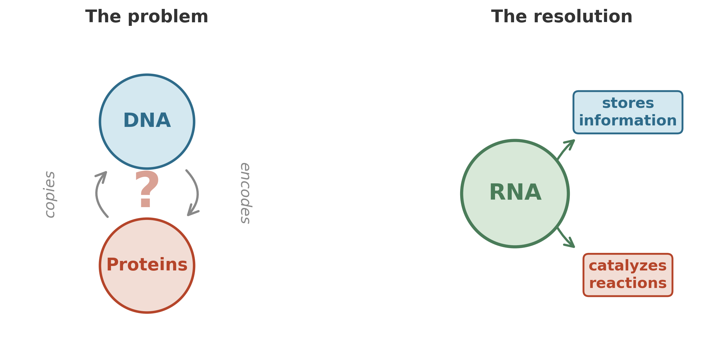

Imagine you find a book.

Not an ordinary book -- this one is written in a language you have never seen, and the ink is a protein that degrades unless it is continuously recopied by a machine. The machine, in turn, is built from instructions contained in the book. Without the machine, the book decays. Without the book, the machine cannot be assembled. Each depends entirely on the other, and neither can exist first.

This is the central paradox of the origin of life, and for decades it stalled progress on the question.

{#fig-rna-world}

In modern cells, the division of labor is clean. DNA stores the instructions. Proteins do the work -- catalyzing reactions, building structures, transporting molecules across membranes. But proteins cannot copy themselves; they need DNA's blueprint. And DNA cannot do anything useful without the proteins that read it, unwind it, and replicate it. Which came first? The question is not rhetorical. It is a genuine engineering bottleneck: you cannot bootstrap a system that requires two specialized components if each component depends on the other for its existence.

The answer, when it arrived, came from an unexpected direction. It came from the molecule that everyone had dismissed as a mere intermediary.

## The middleman steps forward

RNA sits between DNA and proteins in every modern cell. It carries the genetic message from the archive (DNA) to the factory floor (ribosomes, which are themselves largely made of RNA). For most of the twentieth century, RNA appeared to be a passive carrier -- important, but not the molecule doing the work.

Then, in the early 1980s, Thomas Cech and Sidney Altman independently discovered that certain RNA molecules could catalyze chemical reactions.[^cech1986] They were not just carrying information; they were *doing chemistry*. These catalytic RNAs were named ribozymes, and their discovery earned Cech and Altman the Nobel Prize in 1989.[^nobel1989]

The implications were enormous. If RNA can both store information *and* catalyze reactions, then you do not need two separate systems to get life started. You need one. A single type of molecule that reads itself and copies itself -- an autocatalytic loop of replicating RNA, ribozymes catalyzing the synthesis of copies of themselves.[^markov2010a]

This is the RNA world hypothesis: the proposal that the earliest life on Earth was not built from DNA and proteins, but from RNA alone -- organisms without the division of labor that modern cells take for granted. The chicken-and-egg paradox becomes tractable, because RNA is both the chicken and the egg.

The standard RNA alphabet is small: four nucleotides -- adenosine (A), guanosine (G), cytidine (C), and uridine (U) -- plus a handful of modified variants like inosine.[^markov2010b][^rna_bases] With just these letters, RNA can fold into elaborate three-dimensional shapes, creating pockets and surfaces that behave like primitive enzymes. Not as efficient as proteins, not as stable as DNA, but enough. Enough to get the process started.

## Where it happened

Where did RNA chemistry first ignite? Three settings are plausible, and they are not mutually exclusive. Ice can concentrate dilute reactants into tiny liquid pockets between crystals, bringing RNA precursors together at effective concentrations far higher than open water -- and many ribozymes work best at low temperatures.[^markov2010c] Hydrothermal vents provide a continuous supply of reduced gases (CO, H$_2$, HCN) and metal catalysts (iron, nickel) at temperatures where abiotic organic synthesis proceeds readily.[^johnson2008][^miller1953] A third option -- wet-dry cycling on land, in volcanic hot springs or tidal flats -- adds something the other two lack: repeated cycles of hydration and dehydration that concentrate reactants and drive polymerization of nucleotides into longer chains, while also promoting the self-assembly of lipid membranes into protocell-like vesicles.[^damer2020] The cold scenario is strong on the first spark -- concentrating molecules for the initial assembly of self-copying RNA -- but weak on sustained supply. The hot scenario is strong on raw materials but weak on the delicate chemistry of RNA folding. The wet-dry scenario bridges both, but depends on exposed land surfaces -- how much dry land existed on the early Earth remains debated. It is possible that different steps happened in different settings: building blocks synthesized at vents, concentrated by ice or evaporation cycles, assembled into replicators in calmer pools. The planet is large, and chemistry does not respect the boundaries of human narratives.

## The phosphorus problem

Before RNA can copy itself, RNA must exist. And building RNA from scratch requires something that the early Earth did not obviously have in abundance: phosphorus.

RNA's backbone is not made of the nucleotide bases themselves. The bases are the informational part -- the letters. The backbone, the structural spine that holds the letters in order, is a chain of sugar molecules linked by phosphate bridges. Without phosphate, there is no polymer. Without a polymer, there is no information storage. The RNA world hypothesis requires an early habitat rich in reactive phosphorus.[^orgel2004]

Where did it come from? In 2005, Matthew Pasek and Dante Lauretta proposed a striking answer: iron meteorites.[^pasek2005]

The early Earth was under heavy bombardment.[^lhb] Meteorites arrived constantly, and among them were iron-rich bodies containing the mineral schreibersite -- an iron-nickel phosphide.[^schreibersite] When schreibersite corrodes in water, it releases reactive phosphorus compounds. Not the stable, locked-up phosphorus of terrestrial rocks, but forms that can participate in organic chemistry. Pasek and Lauretta showed that this corrosion proceeds readily in aqueous conditions, providing a "highly reactive source of prebiotic phosphorus on the surface of the early Earth."[^pasek2005]

The chemistry of life did not arise in isolation from geology. Meteorites provided phosphorus. Minerals provided surfaces. The ocean provided the solvent. Life did not invent its raw materials; it inherited them from the planet's early bombardment.

## An ocean laced with metal

The ancient ocean was a different solvent than the one we know. It was richer in dissolved heavy metals -- not just iron, which was abundant in a world without free oxygen to rust it out of solution, but also more exotic elements: tungsten, molybdenum, vanadium.[^markov2010d][^metal_ocean]

This matters because many of the enzymes that drive modern biochemistry are not pure protein. They are metalloproteins -- protein molecules with metal ions at their active sites, performing the actual catalytic work.[^metalloproteins] The protein provides the scaffold; the metal does the chemistry. Strip the iron from a cytochrome, the molybdenum from a nitrogenase, the nickel from a urease, and you have a beautifully folded but catalytically dead molecule.

Why would proteins evolve to depend on metals? One compelling answer is that they did not "choose" metals -- they inherited them. In the earliest stages of chemical evolution, before proteins existed, the catalysts were the metals themselves. Iron-sulfur clusters, nickel surfaces, molybdenum compounds -- these inorganic materials can catalyze many of the same reactions that enzymes catalyze today, just less efficiently.[^ironsulfur_world]

The transition from mineral catalyst to protein catalyst was gradual.[^mineral_catalyst] The first proteins, clumsy and short, would have naturally incorporated iron atoms from their iron-rich environment. Those that happened to fold around a metal ion in a useful way gained a catalytic advantage. Over time, proteins became better scaffolds for the metals, and the metals became more precisely positioned within the proteins. But the metals came first. The proteins grew around them like a house built around a hearth.[^markov2010e]

## The recycling problem

Now we arrive at a constraint that reshapes the origin story. It is also counterintuitive.

We have been telling the origin story as if it were about a single lineage: first RNA, then proteins, then DNA, then cells. A lonely molecule in a puddle, gradually becoming more complex. This is the popular version, and it captures something real. But it misses the deepest constraint.

Consider what a living system actually does. It takes in raw materials, transforms them, and produces waste. If it is the only living system around, it will eventually exhaust its raw materials or drown in its own waste. This is not a biological problem; it is a thermodynamic one. A single organism, running a single metabolic strategy, will eventually outpace its local supply of raw materials or accumulate waste faster than the environment can absorb it -- unless something external recycles its waste and restocks its inputs.[^markov2010f][^braakman2013]

The stable existence of any biosphere -- even the most primitive one -- requires relatively closed biogeochemical cycles. Resources must be recycled. One organism's waste must become another organism's food. The carbon that is fixed must eventually be re-oxidized. The sulfate that is reduced must eventually be re-oxidized. The cycle must close, or the system runs down.

A single type of organism is unlikely to close all of these cycles on its own.

There is a significant caveat: an organism that plugs into established geochemical cycles -- food trickling in from geological sources, waste absorbed into geological sinks -- can persist without a biological partner, because the planet itself recycles for it. Early Earth's hydrothermal systems are exactly this kind of flow-through setting. But such a strategy works only while the organism's demands stay modest enough for geological supply to satisfy. The moment metabolism intensifies or diversifies, the geological buffer is overwhelmed, and biological recycling becomes essential.[^markov2010f][^braakman2013]

But for anything more ambitious -- for life that grows, diversifies, and reshapes its environment -- biological recycling is not an optional add-on. It is a structural requirement that arises early.

This shifts the popular narrative. In the standard story, life begins as a solitary replicator and only later learns to cooperate. The biogeochemical argument compresses the timeline: networked communities were not a late luxury but an early necessity, because a biosphere that does not recycle its waste runs down. A single metabolic strategy, running alone, is a geological niche player. Multiple strategies, running together and recycling each other's output, are a cycle. And cycles can persist.

The earliest communities may have been simple. Perhaps methanogenic archaea reduced CO$_2$ to CH$_4$ using hydrogen, while other organisms oxidized the methane or consumed other waste products. Perhaps sulfate reducers and sulfur oxidizers formed the first recycling pair. The details are debated and may never be fully resolved. But the principle is clear: the network -- not the individual cell -- was what allowed early life to outgrow its initial geological niche and sustain metabolism at a scale that could reshape the planet's chemistry.

## The circuit redrawn

We can see this through the lens we built in the first two chapters. Think of the earliest biosphere as a primitive electrical circuit.

Each metabolic type is a different wire connecting a different pair of terminals. Methanogens connect the CO$_2$/CH$_4$ couple. Sulfate reducers connect the SO$_4^{2-}$/H$_2$S couple. Iron oxidizers connect the Fe$^{2+}$/Fe$^{3+}$ couple. No single wire carries enough current to matter for long. But wire them together -- let the products of one reaction become the reactants of another -- and you get a circuit with multiple loops. Current flows continuously, because every product has somewhere to go.

This is what "community" means in thermodynamic terms. It is not a word about feelings or altruism (though those will come later). It is a word about closing circuits. About making sure that the electrons, once moved, have a path back to the beginning.

This is consistent with what the rock record eventually shows. The oldest unambiguous traces of life are the layered structures called stromatolites, dating back more than 3.4 billion years[^stromatolites] -- hundreds of millions of years after life likely began. They do not tell us directly what the first organisms looked like. But what they preserve is not a solitary cell. It is a community:[^microbial_mats] a layered, multi-species mat of cooperating microbes, each occupying a different niche, each performing a different metabolic trick, and each depending on the others to keep the cycles turning. The thermodynamic argument says communities had to emerge early; the stromatolites show that, by the time the record becomes clear, communities are already what we find.

## From spark to city

The chapter began with a paradox: the chicken and the egg, information and machinery, locked in mutual dependence. RNA offered a way out of that paradox by being both at once. But RNA alone does not make a biosphere. A biosphere requires energy capture, waste recycling, and the closing of biogeochemical cycles -- and that requires a community.

The next question is: what did those first communities look like? How did they organize themselves physically? And how did their organization shape the planet?

The answer lies in the most successful architecture in the history of life: the microbial mat. Layered cities of cooperating microbes, stacked by function, connected by chemistry, that ruled the Earth for billions of years before anything with a nucleus existed.

The spark has caught. Now it builds.

## Takeaway

- The chicken-and-egg paradox (DNA needs proteins, proteins need DNA) becomes tractable once you consider RNA, which can store information *and* catalyze reactions -- the strongest current hypothesis for how life bootstrapped itself.
- Life may have started cold (ice concentrating reactants), hot (hydrothermal vents providing building blocks), or on land (wet-dry cycling driving polymerization) -- or in some combination.
- Reactive phosphorus for RNA backbones likely came from iron meteorites corroding in early water.
- Ancient ocean metals (iron, nickel, tungsten, molybdenum) served as the first catalysts; proteins evolved around them.
- A single organism running a single metabolism can persist only where geological fluxes recycle its waste. A durable, growing biosphere requires multiple metabolic strategies recycling each other's output -- so networked communities likely emerged very early.

[^markov2010a]: Kruger et al., *Self-splicing RNA: autoexcision and autocyclization of the ribosomal RNA intervening sequence of Tetrahymena* (1982); Gilbert, *Origin of life: The RNA world* (1986). The first prototype of the future RNA-organism could be the autocatalytic loop formed by replicating RNA molecules -- ribozymes, capable of catalyzing the synthesis of copies of themselves. [@Kruger1982; @Gilbert1986]

[^markov2010b]: Markov (2010). A, G, C, U -- the standard nucleotides: adenosine, guanosine, cytidine and uridine; other letters mark nonstandard (modified) nucleotides, including inosine. [@Markov2010]

[^markov2010c]: Attwater et al., *In-ice evolution of RNA polymerase ribozyme activity* (2013). Many ribozymes work best at low temperatures, sometimes below the freezing point of water. Ice creates tiny cavities with high reactant concentrations, enabling RNA polymerase ribozyme activity at temperatures as low as -19 C. [@Attwater2013]

[^orgel2004]: Leslie E. Orgel, "Prebiotic Chemistry and the Origin of the RNA World," *Critical Reviews in Biochemistry and Molecular Biology* (2004). Orgel outlined the major steps required to establish an RNA world: sugar synthesis, nucleoside synthesis, phosphorylation, formation of long polynucleotides, and separating and copying double-stranded polynucleotides. [@LeslieE:2004jz]

[^pasek2005]: Matthew A. Pasek and Dante S. Lauretta, "Aqueous Corrosion of Phosphide Minerals from Iron Meteorites: A Highly Reactive Source of Prebiotic Phosphorus on the Surface of the Early Earth," *Astrobiology* (2005). [@Pasek2005]

[^johnson2008]: Adam P. Johnson et al., "The Miller Volcanic Spark Discharge Experiment," *Science* 322 (2008): 404. Reanalysis of Stanley Miller's original 1950s volcanic spark discharge samples revealed a wider variety of amino acids and hydroxylated compounds than reported in Miller's classic 1953 paper, demonstrating that volcanic lightning conditions could produce diverse organic building blocks. [@Johnson2008]

[^cech1986]: Thomas R. Cech, "A Model for the RNA-Catalyzed Replication of RNA," *Proceedings of the National Academy of Sciences* 83 (1986): 4360-4363. Cech demonstrated that RNA molecules could act as catalysts, performing chemical reactions without protein enzymes. [@Cech1986]

[^nobel1989]: The 1989 Nobel Prize in Chemistry was awarded jointly to Sidney Altman and Thomas Cech "for their discovery of catalytic properties of RNA." This discovery opened the most promising path through the chicken-and-egg problem by showing that RNA could both store information and catalyze reactions. [@Cech1986]

[^rna_bases]: The four standard RNA nucleotides (A, G, C, U) differ from DNA only in the sugar backbone (ribose vs. deoxyribose) and the substitution of uracil for thymine. This simpler chemistry may reflect RNA's evolutionary priority over DNA. [@Alberts2015]

[^lhb]: The Late Heavy Bombardment (approximately 4.1-3.8 Ga) represents a period of intense meteorite impacts on the inner solar system. This bombardment delivered substantial quantities of volatiles, organics, and reactive minerals including phosphides to the early Earth's surface. [@dePater2015]

[^schreibersite]: Schreibersite (Fe,Ni)₃P is a rare terrestrial mineral but common in iron meteorites. Its corrosion in water produces a range of reduced phosphorus compounds including phosphite and hypophosphite, which are far more reactive in prebiotic chemistry than oxidized phosphate minerals. [@Pasek2005]

[^metal_ocean]: The Archean ocean's metal content reflected the anoxic atmosphere and reduced state of surface minerals. Without photosynthetic oxygen production, iron remained soluble as Fe²⁺ rather than precipitating as Fe³⁺ oxides, creating dissolved iron concentrations orders of magnitude higher than modern oceans. [@Dupont2010]

[^metalloproteins]: Approximately one-third of all known enzymes require metal cofactors for catalytic activity. The most common are iron, zinc, magnesium, and copper, but molybdenum, tungsten, nickel, and vanadium also play essential roles in specific metabolic pathways. [@Dupont2010]

[^ironsulfur_world]: Günter Wächtershäuser, "Before Enzymes and Templates: Theory of Surface Metabolism," *Microbiological Reviews* 52 (1988): 452-484. The iron-sulfur world hypothesis proposes that life originated on charged mineral surfaces of iron sulfide, where the oxidation of FeS to FeS₂ (pyrite) provided energy for carbon fixation. [@Wachtershauser1988]

[^mineral_catalyst]: William Martin and Michael J. Russell, "On the Origins of Cells," *Philosophical Transactions of the Royal Society B* 358 (2003): 59-85. Mineral surfaces, particularly iron-sulfur minerals, can catalyze many of the core reactions of metabolism including carbon fixation and peptide synthesis. [@MartinRussell2003]

[^stromatolites]: Abigail C. Allwood et al., "Stromatolite reef from the Early Archaean era of Australia," *Nature* 441 (2006): 714-718. The oldest well-preserved stromatolites from the Strelley Pool Formation in Western Australia date to 3.43 Ga and provide morphological and geochemical evidence for photosynthetic microbial communities. [@Allwood2006]

[^microbial_mats]: J. William Schopf, "Fossil Evidence of Archaean Life," *Philosophical Transactions of the Royal Society B* 361 (2006): 869-885. Stromatolites represent fossilized microbial mats -- layered communities of bacteria and archaea organized by metabolic function, with photosynthesizers near the surface and anaerobic metabolizers below. [@Schopf2006]

[^miller1953]: Stanley L. Miller, "A Production of Amino Acids Under Possible Primitive Earth Conditions," *Science* 117 (1953): 528-529. Miller's famous experiment demonstrated that organic compounds including amino acids could form spontaneously from simple gases (methane, ammonia, hydrogen, water vapor) subjected to electrical discharge, providing early experimental support for abiotic organic synthesis. [@Miller1953]

[^markov2010d]: Dupont et al., *History of biological metal utilization inferred through phylogenomic analysis of protein structures* (2010). The ancient ocean contained far more dissolved heavy metals than today, including tungsten, molybdenum, and vanadium. Many protein enzymes use metal ions as essential components (metalloproteins). [@Dupont2010]

[^markov2010e]: Dupont et al. (2010). The earliest forms of life actively used simple inorganic catalysts -- especially iron and sulfur compounds. Phylogenomic analysis of protein structures shows that the earliest metal-binding domains preferentially bound metals abundant in the Archean ocean, with proteins evolving around pre-existing mineral catalysts. [@Dupont2010]

[^braakman2013]: Rogier Braakman and Eric Smith, "The compositional and evolutionary logic of metabolism," *Physical Biology* 10 (2013): 011001. Argues that core metabolic pathways reflect ancient network-level constraints: individual pathways are incomplete without complementary reactions that close elemental cycles. [@Braakman2013]

[^damer2020]: Bruce Damer and David Deamer, "The Hot Spring Hypothesis for an Origin of Life," *Astrobiology* 20 (2020): 429-452. Wet-dry cycling in terrestrial hot springs drives polymerization of nucleotides and self-assembly of lipid vesicles, providing both longer RNA chains and primitive compartments. [@Damer2020]

[^markov2010f]: Markov (2010). A stable, growing biosphere requires relatively closed biogeochemical cycles. A single organism in a flow-through geological setting can persist, but diversification and intensification of metabolism require biological recycling partners. [@Markov2010]
