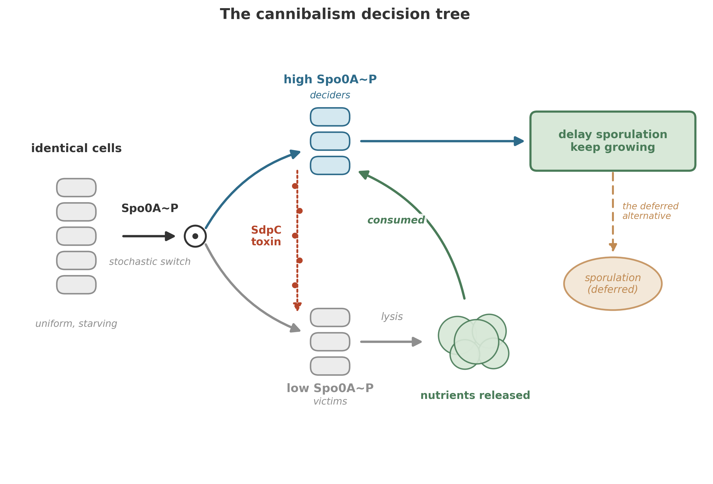

A population of *Bacillus subtilis* is starving. Instead of dying together, a fraction of the cells kill and eat the rest. The molecular machinery behind this strategy is one of the best-documented social behaviors in microbiology---and it is far from the only one.

We are leaving the physics of energy and electrons behind (temporarily) and asking a different question: **once cells exist and compete, what kinds of relationships do they build?**

The answer matters for everything that comes later. Eukaryotic cells---the kind that eventually built animals, plants, and fungi---did not arise from a single lucky mutation. They arose from mergers, and mergers are easier to stabilize in a world already full of social interactions: communication, exploitation, and occasionally, negotiated truces between former enemies. Before we can tell that story (the next chapter), we need to understand the social world that made it possible.

## The birth of altruism

Cooperative behaviors---shared public goods, coordinated gene expression, programmed cell death that benefits neighbors---are found across divergent bacterial lineages.[^social_evolution] The simplest explanation for that distribution is that cooperation is ancient---or repeatedly reinvented under similar selective pressures. It is written in the behavior of modern bacteria, which still carry the molecular toolkits of that social world.

The foundation of microbial social life is chemical communication. Bacteria secrete small molecules into their environment---signals that diffuse outward and are detected by neighboring cells. Through this chemical "dialogue," microorganisms report their condition and influence their neighbors' behavior.[^social_evolution] The signals are not noise. They encode information: *I am starving*. *I am dividing*. *There are many of us here*. *There are few*.

And from these signals, a pattern emerged that looks, functionally, like altruism---the ability to sacrifice one's own interests for the good of the community.[^social_evolution]

That word---altruism---makes biologists nervous when applied to bacteria, and rightly so. A bacterium does not "decide" to be generous. It carries genetic circuits that, under certain conditions, cause it to produce costly public goods, or to die so that its neighbors may feed. The altruism is encoded, not chosen. But the functional outcome is the same: individual cells pay a fitness cost so that the group benefits. And the evolutionary logic that maintains these behaviors is surprisingly sophisticated.

To see how sophisticated, consider a single species that can grow flagella and swim, assemble into packs, communicate by quorum sensing, share public goods, build spore-forming fortresses, and---when all else fails---murder a substantial fraction of its own population. That species is *Bacillus subtilis*.

## *Bacillus subtilis*: the bacterium that does everything

*Bacillus subtilis* is a soil bacterium, a gram-positive rod that has been studied in laboratories for over a century. It was one of the first bacteria to have its genome sequenced.[^kunst_genome] It is the workhorse of bacterial genetics, the *E. coli* of the gram-positive world. And yet, for decades, most of that research was done on well-fed cells growing in shaking flasks---conditions under which *B. subtilis* behaves like the simple, solitary creature of the textbook picture.

Take it out of the flask. Put it in soil, on a root surface, in a biofilm, or in a colony on an agar plate where nutrients are running low. Now it transforms.

When conditions demand it, *B. subtilis* can grow flagella and acquire motility, swimming toward nutrients or away from toxins. It can collect into organized "packs" with consistent, coordinated movement. It can secrete enzymes that break down complex molecules in the environment---a costly investment that benefits all nearby cells, not just the producer. It can form biofilms: dense, structured communities encased in a self-produced matrix of proteins and polysaccharides.[^flemming_biofilm] And it can make "decisions"---or more precisely, its genetic circuits can be triggered into discrete, stable states---based on chemical signals received from relatives.[^social_evolution]

The mechanism that coordinates many of these transitions is **quorum sensing**: bacteria secrete small signaling molecules (autoinducers) into the surrounding medium and simultaneously detect them.[^quorum_sensing_review][^bassler_bacterial] Each cell contributes signal; each cell measures the local concentration. When the concentration crosses a threshold---when the quorum is reached---the behavior of the entire population shifts. (The process is often described as "voting," though as the sidebar notes, density-sensing or even diffusion-sensing may be more accurate.)

::: {.callout-note}
## Sidebar --- How quorum sensing works

Quorum sensing is not a single system. Different bacterial species use different signal molecules, different receptors, and different downstream circuits. But the basic logic is shared:

1. **Signal production**: Each cell constitutively produces a small signaling molecule (an autoinducer) at a low basal rate.
2. **Signal accumulation**: The autoinducer diffuses into the environment. At low cell density, the molecule diffuses away faster than it accumulates. At high cell density, it builds up.
3. **Threshold detection**: When the local concentration exceeds a threshold, receptor proteins inside (or on the surface of) each cell become activated.
4. **Coordinated response**: The activated receptors trigger a transcriptional program that changes the cell's behavior---biofilm formation, toxin production, sporulation, or dozens of other responses.

The elegance is in the coupling: because each cell both produces and detects the signal, the system functions as a distributed sensor for population density. The "decision" emerges from the sum of individual contributions, and no central authority is needed.

The voting metaphor captures the logic of density-dependent coordination but simplifies: real autoinducer concentrations reflect not just cell number but diffusion geometry, flow regime, and the spatial arrangement of producers---what some researchers call "efficiency sensing" rather than quorum sensing.[^redfield_qs]
:::

Through quorum sensing and other regulatory circuits, *B. subtilis* populations can assemble into multicellular aggregates approaching the complexity of true multicellular organisms. Biofilms have internal architecture: channels for nutrient transport, differentiated cell types (some produce matrix, some produce enzymes, some are motile scouts), and spatial organization that is not random but functionally structured.

The most dramatic social behavior of *B. subtilis* is cannibalism.

## The cannibalism strategy

Imagine a population of *B. subtilis* in soil. Nutrients have been declining for hours. The cells have already tried the obvious responses: ramping up enzyme secretion to scavenge what remains, adjusting their metabolic pathways, slowing growth. Nothing has worked. Starvation is now severe.

The cell has one remaining option that guarantees survival: sporulation. A *B. subtilis* spore is one of nature's most resilient structures---resistant to heat, desiccation, UV radiation, and chemical assault.[^setlow_spore] A spore can wait for decades, even centuries, and germinate when conditions improve.

But sporulation is expensive.

The decision to commit to spore formation is not taken lightly.[^ellermeier_cannibalism] Sporulation requires the coordinated activation of approximately 500 genes over a period of 6 to 8 hours.[^stragier_sporulation] The process involves a complete reorganization of the cell: an asymmetric division that produces a smaller forespore and a larger mother cell, followed by engulfment of the forespore by the mother cell, assembly of a multi-layered protective coat, and finally, programmed death of the mother cell to release the mature spore. The commitment becomes irreversible after roughly 2 hours---once the cell passes that point, it *will* sporulate or it will die trying.[^ellermeier_cannibalism]

Given this investment of time and energy, it should not surprise us that *B. subtilis* treats sporulation as a last resort. Before committing, the cell exhausts every alternative. It searches for new nutrients. It adjusts its metabolism. It waits.

And then, as a penultimate measure---the step just before the final, irreversible commitment to spore formation---it turns to cannibalism.

{#fig-cannibalism}

Here is how it works.[^ellermeier_cannibalism]

When starvation activates the master sporulation regulator, a transcription factor called Spo0A, something unexpected happens: Spo0A does not activate uniformly across the population. Instead, due to stochastic fluctuations in gene expression and positive feedback loops in the phosphorelay that activates Spo0A, the population splits. A fraction of cells---the exact proportion depends on starvation severity and growth history---accumulate high levels of active Spo0A (Spo0A~P). The remainder stay with low levels.

The high-Spo0A cells begin producing a secreted protein called **SdpC**---a toxin. SdpC is exported into the environment, where it attacks and kills the cells that have *not* activated Spo0A. The low-Spo0A cells, lacking the immunity machinery, are lysed. Their cellular contents---proteins, nucleic acids, lipids, all the organic matter that a starving cell desperately needs---spill into the medium.

The killers eat the dead.

The nutrients released by the lysed cells are taken up by the surviving, toxin-producing population. Fed by the remains of their siblings, the cannibals can delay sporulation---sometimes avoiding it altogether if the influx of nutrients is sufficient to restart growth.

The cannibalism system requires a precise answer to a lethal question: how does a toxin-producing cell avoid killing itself? The answer is a three-protein signaling pathway that couples toxin production to immunity. SdpC is the toxic protein, exported by cells with high Spo0A~P. SdpI is the immunity protein, a polytopic membrane protein that protects the cell from SdpC. And SdpR is an autorepressor that, in the absence of SdpC, blocks transcription of the immunity gene -- keeping defenses low when no threat is present.[^ellermeier_cannibalism]

The elegant twist: SdpI is not only an immunity protein but also a signal-transduction protein. When SdpC contacts SdpI in the membrane, SdpI sequesters SdpR -- pulling the repressor away from the DNA and trapping it at the membrane. With SdpR removed, the cell ramps up production of more immunity protein. The result is a self-reinforcing circuit: toxin in the environment stimulates production of immunity. Cells making the toxin automatically induce their own protection. Cells not making the toxin do not induce immunity fast enough and are killed.

The cannibalism strategy only works at high population density---which makes sense, because it depends on the toxin reaching enough victims to release enough nutrients to matter. At low density, the few cells that lyse would not provide enough food to justify the energetic cost of toxin production. Quorum sensing, again, sets the stage: the population must be dense enough that cannibalism pays.

The population-level accounting is stark. The population invests in a toxic public good (SdpC), splits itself into killers and victims through a stochastic switch, and recycles a substantial fraction of its members. The survivors gain time. If new nutrients arrive during that borrowed time, the entire surviving population benefits. If they do not, the survivors proceed to sporulation---but now with a head start, having fed on the remains of their kin.

## *Myxococcus xanthus*: the social predators

*Bacillus subtilis* eats its own. *Myxococcus xanthus* eats everyone else---and it does so cooperatively.

*Myxococcus xanthus* is the best-characterized species of soil-dwelling myxobacteria, a group distinguished by two remarkable properties: cooperative predation and social development.[^fiegna_myxo][^velicer_myxo] Where most predatory bacteria act alone---a single cell encountering a single prey---*M. xanthus* hunts in packs.

Predation is accomplished by swarming groups of cells that secrete toxic and lytic metabolites---antibiotics, enzymes, and other compounds that kill and degrade prey organisms.[^fiegna_myxo][^berleman_predation] The killing agents diffuse outward from the swarm, creating a zone of destruction around the advancing pack. The prey cells lyse, and their contents form an extracellular public pool of nutrients that the entire swarm shares. No individual *M. xanthus* cell could produce enough antibiotics or lytic enzymes to kill prey efficiently on its own. The predatory strategy works only because the costs are shared and the benefits are pooled.

This is cooperative predation in the truest sense: a hunting behavior that depends on group size, coordinated movement, and the production of extracellular public goods.

But the social life of *M. xanthus* does not end with feeding. When amino acids become scarce---when the hunting has failed or the prey is exhausted---*M. xanthus* enters its most dramatic phase: the construction of fruiting bodies.[^kaiser_fruiting]

Upon amino-acid deprivation, individual cells begin to aggregate. They stream toward central collection points, piling up into mounds that grow into elaborate, species-specific structures: the fruiting bodies. A typical *M. xanthus* fruiting body contains roughly 100,000 cells, assembled through coordinated movement and the exchange of intercellular chemical signals.[^fiegna_myxo][^kaiser_c_signal]

Inside the fruiting body, a fraction of the cells differentiate into stress-resistant spores---the myxobacterial equivalent of the *B. subtilis* endospore. But here is the grim arithmetic: **only a minority of cells survive development**. The majority die during the construction process, their cellular contents presumably fueling the differentiation of the survivors.

Competition for the limited sporulation "slots" inside a fruiting body is a major component of fitness in *M. xanthus* populations.[^fiegna_myxo] If you are a cell entering a fruiting body, your odds of becoming a spore depend on your genotype, your position, your signaling interactions with neighbors, and the social composition of the aggregate. Cheaters---mutant cells that contribute less to the public good but sporulate at higher rates---are a constant evolutionary threat. And yet, cooperation persists.

::: {.callout-note}
## Sidebar --- The cheater problem and evolutionary stability

The existence of cooperative behaviors in microbes raises a classic evolutionary puzzle: why don't cheaters take over? A cheater mutant that enjoys the benefits of group predation (shared nutrients) without paying the costs (producing expensive lytic enzymes) should, in the short term, outcompete cooperators.

And indeed, cheater mutants have been isolated in *M. xanthus*. They arise readily, they exploit cooperators, and they can spread within populations.

The resolution involves several mechanisms:

- **Kin selection**: in structured environments (soil, biofilms), cells tend to interact with close relatives. Helping relatives indirectly promotes copies of one's own genes.[^hamilton_kin][^west_kin]
- **Population structure**: cheaters that destroy the cooperative group they depend on ultimately destroy themselves. In spatially structured environments, cooperative groups can outcompete or outlast cheater-dominated groups.[^griffin_cooperation]
- **Policing mechanisms**: some cooperative systems include active enforcement against non-kin or non-cooperators---for example, bacteriocins that target competing strains, or contact-dependent inhibition systems that kill unrelated neighbors.[^travisano_policing] (*B. subtilis* cannibalism, by contrast, is better understood as bet-hedging: the "victims" are not cheaters but the other outcome of a stochastic developmental switch.)

The upshot is that microbial cooperation is not naive. It is enforced, policed, and maintained by mechanisms that punish free riders. The "altruism" is real, but it is not unconditional.
:::

The parallels between *M. xanthus* and *B. subtilis* are instructive. Both species use quorum sensing to coordinate group behavior. Both form complex multicellular structures under stress. Both sacrifice a fraction of their population so that the rest may survive. And both face---and have solved, at least partially---the problem of cheaters.

But the parallels extend further than any two species. These social behaviors are not oddities confined to a few laboratory favorites. Chemical signaling, quorum sensing, biofilm formation, and programmed cell death have been documented in hundreds of bacterial species across nearly every major lineage.[^miller_quorum][^nadell_biofilm] The social life of microbes is not an exception. It is the rule.

## How cells "decide": the metabolic logic

To understand microbial social behavior, we need to understand how a single cell makes a "decision." Not a conscious decision---a physical one. A cell does not deliberate. It integrates chemical signals through molecular circuits and arrives at a discrete output state: divide or stop, swim or stick, cooperate or defect, sporulate or eat.

The machinery that enables these decisions begins with the most fundamental currency of cellular life: **ATP**.

The ATP supply in a typical bacterial cell is on the order of millions of molecules, and the pool turns over on a timescale of seconds---the exact numbers vary with cell size, growth rate, and conditions.[^karp_atp] A cell does not "have" energy the way a battery has charge. The pool is in dynamic equilibrium, synthesis and consumption matched so tightly that the total count stays roughly constant even as individual molecules are consumed and regenerated within seconds.

The cell tunes its enzymes through phosphorylation, allosteric modulation, and feedback inhibition---layered mechanisms that allow it to continuously adjust its metabolic state in response to internal and external signals.[^monod_allosteric] But the key question for our story is how the cell reads its own energy status.

In bacteria, falling energy charge---sensed directly by metabolic enzymes that respond to the ATP-to-AMP ratio---activates catabolic pathways and suppresses biosynthesis.[^atkinson_energy] AMP is a more sensitive indicator than ATP: a small decrease in ATP causes a proportionally larger increase in AMP, amplified by the adenylate kinase reaction ($2\,\text{ADP} \rightleftharpoons \text{ATP} + \text{AMP}$). When the imbalance is severe, a second alarm fires: the stringent response, mediated by the signaling nucleotides (p)ppGpp, which reprograms transcription wholesale---shutting down ribosome synthesis, activating amino-acid scavenging, and preparing the cell for survival mode.[^stringent_response] (In eukaryotes, an analogous role is played by AMP-activated protein kinase, AMPK.[^hardie_amp])

This metabolic regulation is not "decision-making" in the way we usually mean the phrase. It is feedback control---the same logic that governs a thermostat. But when you layer multiple feedback loops on top of each other, wire them to external signals (like quorum-sensing molecules), and allow them to interact through shared intermediates, the system can produce something more interesting than gradual adjustment.

It can produce switches.

## Bistability: the molecular basis of commitment

Some cellular decisions are not graded. They are all-or-none.

Cell division is either happening or it is not. Apoptosis (programmed cell death) is either triggered or it is not. Sporulation is either committed or it is not. These are not analog dials that can be set to any intermediate position. They are binary switches that snap between discrete states.[^ferrell_bistable]

The molecular circuits that produce this switch-like behavior are called **bistable systems**, and their logic has been worked out in considerable detail.

A bistable system has two stable steady states and an unstable threshold between them. Push the system gently, and it snaps back to whichever state it was in. Push it past the threshold, and it snaps to the other state---and stays there. The transition is sharp, and the new state is self-maintaining: even if the original push is removed, the system remains in its new configuration.

Two basic circuit architectures can produce bistable switching. The first is **positive feedback**: a molecule promotes its own production; once production exceeds a threshold it accelerates, driving the system to a high-expression state, while below the threshold production cannot sustain itself.[^becskei_bistable] The second is **double-negative feedback** (mutual inhibition): two regulators each repress the other, creating two stable states (A-on/B-off and A-off/B-on) with no intermediate.[^gardner_toggle]

Both architectures share two properties. First, persistence: once the switch flips, it stays flipped, even after the triggering signal is removed -- a transient pulse of starvation can produce a permanent change in cell fate. Second, an all-or-none response: cells do not end up "half-sporulated" or "partially committed."

In *B. subtilis* sporulation, the Spo0A phosphorelay exhibits exactly this kind of bistable behavior. Stochastic variation in Spo0A~P levels, amplified by positive feedback, pushes individual cells past the threshold -- or not. The result is a mixed population: some cells with high Spo0A~P (headed for sporulation or cannibalism) and some with low Spo0A~P (destined to be victims or to resume growth if conditions improve).

Bistability explains something that would otherwise be puzzling about the *B. subtilis* cannibalism system. Why does only a fraction of the population produce toxin? If starvation is the signal, and all cells are equally starved, why doesn't the entire population activate Spo0A and start killing?

The answer is that the Spo0A circuit is bistable. Small, random differences in Spo0A~P concentration among individual cells are amplified by positive feedback until the population splits into two distinct subpopulations. This is not a failure of regulation. It is the whole point. The system is designed---evolved---to produce a mixed population in response to a uniform signal, because a mixed population hedges its bets. If conditions improve, the non-sporulating cells can resume growth immediately. If conditions worsen, the sporulating fraction has a head start on spore formation.

Bistability shows up far beyond sporulation. It underlies genetic competence (the ability to take up foreign DNA), biofilm formation, motility transitions, and many other developmental switches in bacteria. At a deeper level, it underlies some of the most fundamental decisions in all of biology: the choice between cell division and cell death, the commitment to a particular cell fate during development, the activation of immune responses.[^ferrell_bistable]

And the principle extends to even richer dynamics. Phosphorylation processes---the same covalent modifications we discussed in metabolic regulation---can serve as multistable systems, supporting not just two but potentially unlimited numbers of stable states.[^thomson_multi] A protein with multiple phosphorylation sites can exist in many distinct configurations, each with different activity. The number of stable states a system can support grows with the number of modification sites, creating a molecular memory that is far richer than a simple on/off switch.

## The ecology of decision

The pieces fit together.

A single bacterial cell contains metabolic feedback loops that adjust its energy state in real time. Layered on top of these are bistable genetic circuits that can snap the cell between discrete states---growing, sporulating, producing toxin, becoming competent, building biofilm matrix. And these circuits are wired to external inputs: quorum-sensing signals that report population density, nutrient signals that report environmental conditions, and direct cell-cell contacts that report the physical neighborhood.

The result is not a collection of isolated automata bumping through liquid. It is an ecology of decision-makers, each one integrating local information and producing behaviors that depend on what their neighbors are doing.

Consider the sequence of events when a *B. subtilis* population faces starvation:

1. Individual cells detect declining nutrients through metabolic feedback (falling ATP, rising AMP).
2. Spo0A is gradually activated through the phosphorelay, but activation is noisy---some cells cross the bistable threshold before others.
3. Quorum-sensing molecules report that population density is high.
4. The high-Spo0A subpopulation begins producing SdpC toxin. The low-Spo0A subpopulation is killed. Nutrients are released.
5. If the nutrient pulse is sufficient, the surviving cells delay sporulation and resume growth. If not, they proceed to sporulate.

Every step involves feedback. Every step depends on population-level information. And the outcome---who lives, who dies, who sporulates---is not determined by any single cell but by the collective state of the population.

The outcome resembles a vote: each cell contributes a chemical signal, and the population-level response integrates them all. No central authority dictates the outcome. It emerges from the distributed computation of thousands of cells, each following the same molecular rules.

## The ancient social contract

Altruism, cooperation, voting, and organized social behavior are not human inventions. They are not even animal inventions. They are microbial inventions, and the molecular toolkits behind them---quorum-sensing circuits, toxin-immunity systems, programmed cell death---are found across divergent bacterial lineages, suggesting great antiquity.

When we watch a colony of *B. subtilis* split into killers and victims, we are watching a social contract enforced by chemistry: a population-level strategy in which individual sacrifice produces collective survival. When we watch *M. xanthus* swarms hunt prey and build fruiting bodies, we are watching cooperative predation and division of labor---behaviors we associate with wolves and ants, not with single-celled organisms.[^crespi_comparison]

The molecular details differ from anything in the animal world. There are no neurons, no hormones, no immune cells in the mammalian sense. But the functional logic---the game theory, the evolutionary pressures, the tension between cooperation and cheating---is analogous. Natural selection does not care whether a social contract is executed by neurons or by transcription factors. It cares only whether the strategy persists.

And these strategies have persisted. The quorum-sensing circuits, the bistable switches, the toxin-immunity systems, the programmed cell death pathways---all of them are found across divergent lineages, implying that they have been maintained by selection over vast stretches of time and elaborated into the astonishing variety of microbial social behaviors we observe today.

This has a practical consequence for the rest of the book. When we reach the great mergers described in the next chapter---the endosymbiotic events that produced mitochondria and chloroplasts, the construction of the eukaryotic cell from archaeal and bacterial partners---we will not be describing a sudden, miraculous leap from solitude to cooperation. We will be describing the latest chapter in a social history that was already ancient.

The bacteria had been signaling, cooperating, and consuming each other long before the first eukaryote stirred.

## Where we go next

In the next chapter, we turn from social strategies to the most consequential social event in the history of life: the merger. One cell swallowing another and, instead of digesting it, keeping it alive. The birth of the eukaryotic cell was not an invention. It was an alliance---forged by organisms that already competed, cooperated, and killed.

## Takeaway
- Bacteria are social organisms: they communicate, cooperate, compete, and make collective "decisions" through chemical signaling.
- Quorum sensing functions as a distributed density-inference system---often described as "voting"---allowing populations to coordinate behavior.
- *Bacillus subtilis* cannibalism is a population-level survival strategy: bistable circuits split the population, toxin-producing cells kill and consume non-producing siblings, buying time before sporulation.
- *Myxococcus xanthus* hunts cooperatively and builds multicellular fruiting bodies, with most cells sacrificing themselves so a minority can sporulate.
- Cellular "decisions" arise from metabolic feedback (ATP/AMP sensing), covalent modification, allosteric regulation, and bistable genetic circuits.
- Altruism, cooperation, and social behavior are not animal inventions---their molecular toolkits span divergent bacterial lineages, implying deep evolutionary roots.

[^social_evolution]: For a review of social evolution theory applied to microorganisms -- including cooperation, altruism, and public goods -- see West et al. (2006). [@West2006]

[^quorum_sensing_review]: For a comprehensive review of quorum-sensing architectures and their role in coordinating population-level behavior, see Waters and Bassler (2005). [@WatersBassler2005]

[^ellermeier_cannibalism]: The molecular mechanism of *B. subtilis* cannibalism, including the SdpC/SdpI/SdpR signaling pathway, is detailed in Ellermeier et al. (2006). [@Ellermeier2006]

[^karp_atp]: Gerald Karp, *Cell and Molecular Biology* (2008). [@Karp2008]

[^ferrell_bistable]: James Ferrell (2002) describes bistability as the basis for all-or-none cellular decisions, including cell division and apoptosis. [@Ferrell2002]

[^gardner_toggle]: Gardner, Cantor, and Collins (2000) constructed a synthetic genetic toggle switch in *E. coli*, demonstrating that double-negative feedback is sufficient for bistability. [@Gardner2000]

[^becskei_bistable]: Becskei, Seraphin, and Serrano (2001) showed that positive feedback in eukaryotic gene networks converts graded inputs to binary (all-or-none) responses. [@Becskei2001]

[^thomson_multi]: Thomson and Gunawardena (2009) demonstrated that multisite phosphorylation systems can support unlimited numbers of stable steady states. [@Thomson2009]

[^fiegna_myxo]: Fiegna et al. (2006) characterize *M. xanthus* as distinguished by cooperative predation and social development, with competition for sporulation slots as a major fitness component. [@Fiegna2006]

[^kunst_genome]: The complete genome sequence of *Bacillus subtilis* (4.2 Mb, ~4,100 genes) was published by Kunst et al. (1997), making it one of the first gram-positive bacteria to be fully sequenced. [@Kunst1997]

[^flemming_biofilm]: The biofilm matrix is composed of extracellular polysaccharides, proteins, and DNA that encases cells in a self-produced structure; see Flemming and Wingender (2010) for a comprehensive review. [@Flemming2010]

[^bassler_bacterial]: Bassler and Losick (2006) provide an accessible overview of bacterial cell-cell communication systems, including quorum sensing and its role in coordinating collective behavior. [@BasslerLosick2006]

[^setlow_spore]: *Bacillus subtilis* endospores exhibit extreme resistance to heat (surviving 100°C for hours), radiation (withstanding UV and gamma rays at doses lethal to vegetative cells), and chemical assault (including oxidizers, aldehydes, and detergents); see Setlow (2006). [@Setlow2006]

[^stragier_sporulation]: Sporulation in *B. subtilis* is controlled by a cascade of sigma factors activating roughly 500 genes in a tightly regulated temporal sequence; see Stragier and Losick (1996). [@Stragier1996]

[^velicer_myxo]: For an overview of the social evolution and developmental biology of myxobacteria, including experimental evolution studies of cooperation and cheating, see Velicer and Vos (2009). [@VelicerVos2009]

[^berleman_predation]: *Myxococcus xanthus* produces a cocktail of secondary metabolites including antibiotics, bacteriolytic enzymes, and biosurfactants that collectively kill and lyse prey cells; see Berleman and Kirby (2009). [@BerlemanKirby2009]

[^kaiser_fruiting]: Fruiting body formation in *M. xanthus* involves aggregation of up to 10^5 cells into macroscopic structures; see Kaiser (2004) for a review of the developmental program. [@Kaiser2004]

[^kaiser_c_signal]: The C-signal is a surface-associated protein that requires direct cell-cell contact and coordinates aggregation and sporulation during fruiting body development; see Kroos et al. (1986). [@Kroos1986]

[^hamilton_kin]: Hamilton's rule (rB > C) formalizes kin selection: altruistic behavior is favored when the benefit to relatives (B), weighted by relatedness (r), exceeds the cost to the actor (C); see Hamilton (1964). [@Hamilton1964a; @Hamilton1964b]

[^west_kin]: West et al. (2007) review the application of kin selection theory to microbial systems, showing that relatedness structure in biofilms and colonies can maintain cooperation. [@West2007]

[^griffin_cooperation]: Griffin et al. (2004) demonstrate experimentally that spatial structure (limited dispersal) maintains cooperation in *Pseudomonas aeruginosa* by ensuring that cooperators interact preferentially with other cooperators. [@Griffin2004]

[^travisano_policing]: Travisano and Velicer (2004) review policing mechanisms in microbial populations, including toxin-immunity systems that eliminate non-cooperators. [@TravisanoVelicer2004]

[^miller_quorum]: Quorum sensing has been identified in more than 150 bacterial species across diverse phylogenetic groups; see Miller and Bassler (2001). [@MillerBassler2001]

[^nadell_biofilm]: Nadell et al. (2016) review the ecological and evolutionary dynamics of biofilm formation across bacterial taxa, emphasizing the prevalence of matrix production as a cooperative trait. [@Nadell2016]

[^monod_allosteric]: The concept of allosteric regulation was formalized by Monod, Changeux, and Jacob (1963), describing how regulatory molecules binding at sites distinct from the active site can modulate enzyme activity. [@MonodChangeuxJacob1963]

[^hardie_amp]: AMP-activated protein kinase (AMPK) is the master regulator of energy homeostasis in eukaryotes, activated by rising AMP/ATP ratios; see Hardie (2007). In bacteria, energy-charge sensing operates through direct AMP binding to metabolic enzymes rather than through a single master kinase. [@Hardie2007]

[^stringent_response]: The stringent response, mediated by (p)ppGpp, is the primary transcriptional reprogramming mechanism bacteria use under nutrient stress. It redirects resources from growth to survival. Hauryliuk et al. (2015) provide a comprehensive review. [@Hauryliuk2015]

[^redfield_qs]: Redfield (2002) argued that quorum sensing may often function as "diffusion sensing" -- measuring how well secreted molecules accumulate locally -- rather than as a true census of cell number. [@Redfield2002]

[^atkinson_energy]: The "energy charge" concept, defined as ([ATP] + 0.5[ADP]) / ([ATP] + [ADP] + [AMP]), was introduced by Atkinson (1968) to describe cellular energy status; AMP is a sensitive indicator because adenylate kinase amplifies small ATP changes. [@Atkinson1968]

[^crespi_comparison]: Crespi (2001) draws explicit parallels between microbial social behaviors (quorum sensing, cooperative predation, altruistic cell death) and the eusocial insects, arguing that similar selective pressures produce convergent social strategies. [@Crespi2001]
