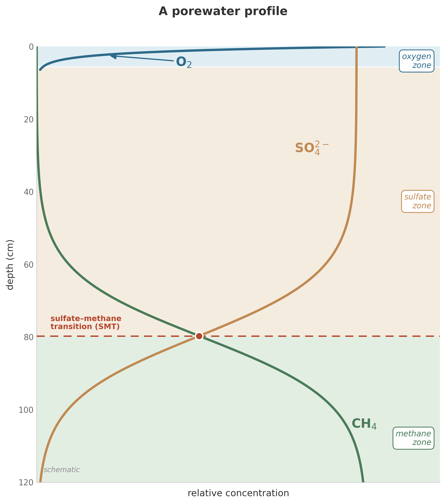

{#fig-porewater-profile}

A sediment core can look, at first glance, like three quiet curves on a page. The x-axis is concentration. The y-axis is depth below the sediment-water interface, increasing downward. The curves are oxygen, sulfate, and methane, measured in the porewater of a marine sediment somewhere on a continental margin.

Oxygen drops from near-saturation at the interface to zero within the first few centimeters. Sulfate holds steady through the oxygen zone, then declines over the next meter. Methane is absent at the top, barely detectable through the sulfate zone, and then rises sharply from below, increasing with depth until it reaches concentrations limited only by solubility and pressure.

Where the sulfate curve and the methane curve cross, there is a narrow band -- a few centimeters wide -- where both are present at low concentrations. This is the sulfate-methane transition zone, one of the most studied features in marine geochemistry. Something is consuming both sulfate and methane at this depth. Something is pulling both curves toward zero at the same horizon.

That something is biology: a consortium of anaerobic methanotrophic archaea and sulfate-reducing bacteria, working together to oxidize methane with sulfate in a reaction that is thermodynamically marginal and kinetically slow:

$$
\text{CH}_4 + \text{SO}_4^{2-} \longrightarrow \text{HCO}_3^- + \text{HS}^- + \text{H}_2\text{O}
$$

The organisms are real. The reaction is real. But the *shape* of the curves -- why oxygen drops fast and sulfate drops slowly, why methane rises from below, why the transition zone sits here and not somewhere else -- cannot be explained by intuition alone. It requires bookkeeping.

This chapter is about that bookkeeping: how to turn a porewater profile into a quantitative story. The same conservation law, written once and applied species by species, lets us ask practical questions. Why does this boundary sit where it does? How far would it move if organic matter delivery doubled? How much methane escapes if transport outruns biology?

One equation is enough to begin.

## Conservation: the only law you need

Every model in this book -- every profile, every flux, every prediction -- rests on a single principle: **mass is conserved**.[^berner1980] Whatever enters a volume of sediment must either leave it, react within it, or accumulate. There are no other options.

Write this as an equation. Consider a thin slab of sediment at some depth $x$, with thickness $\Delta x$. Let $\hat{C}$ be the bulk concentration of a chemical species -- the amount per unit volume of sediment (not per unit volume of porewater; that distinction matters and we will get to it). The rate of change of $\hat{C}$ in that slab is:

$$
\frac{\partial \hat{C}}{\partial t} = -\frac{\partial F}{\partial x} + \sum R_i
$$

Three terms. Each one does exactly one job.

**The left side** ($\partial \hat{C} / \partial t$) is the rate of accumulation. If the concentration in the slab is increasing, this term is positive. If it is decreasing, this term is negative. At steady state -- when the profile is not changing with time -- this term is zero.

**The first term on the right** ($-\partial F / \partial x$) is the divergence of flux. $F$ is the flux of the species -- the amount moving through a unit area per unit time. If more stuff flows into the slab from above than flows out below, the concentration increases. If more flows out than in, it decreases. The minus sign and the derivative handle the bookkeeping automatically.

**The second term** ($\sum R_i$) is the sum of all reactions that produce or consume the species. A reaction that produces the species contributes a positive $R_i$. A reaction that consumes it contributes a negative $R_i$. If there are multiple reactions acting on the same species -- which there always are -- you add them all up.

That is the entire equation. It says: the rate of change equals what comes in minus what goes out, plus what is produced minus what is consumed. It is an accounting identity, nothing more, nothing less.

Everything else is details. Important details -- but details.

## What moves: transport

The flux $F$ has two components in most sediment and groundwater settings: diffusion and advection.

**Molecular diffusion** moves dissolved species down their concentration gradients. The flux is:

$$
F_{\text{diff}} = -\phi \cdot D_s \cdot \frac{\partial C}{\partial x}
$$

where $\phi$ is porosity (the fraction of the sediment that is porewater), $D_s$ is the effective diffusion coefficient in the sediment (smaller than in free water, because the pore network is tortuous), and $C$ is the porewater concentration. The minus sign means stuff moves from high concentration to low. This is Fick's first law, applied to a porous medium.[^fick1855] The relationship between the sediment diffusion coefficient and the free-solution value involves both porosity and tortuosity -- a geometric correction that accounts for the increased path length molecules must travel through the pore network.[^boudreau1997]

A useful intuition: the timescale for diffusion to operate over a distance $L$ is:

$$
\tau_{\text{diff}} \sim \frac{L^2}{D_s}
$$

For $D_s \approx 10^{-5}$ cm$^2$/s (a typical value for ions in sediment[^ligregory1974]) and $L = 1$ cm, $\tau \approx 10^5$ seconds -- about a day. For $L = 1$ m, $\tau \approx 10^{9}$ seconds -- about 30 years. Diffusion is fast over millimeters and geological over meters. This single scaling explains why most of the action in a sediment profile happens in the top meter: below that, diffusion is too slow to deliver reactants from the interface.

**Advection** moves material with the flowing medium. For dissolved species, the flux is:

$$
F_{\text{adv}} = \phi \cdot u \cdot C
$$

where $u$ is the porewater velocity. For solid species (organic particles, minerals, biomass), the corresponding flux uses the solid-phase velocity $w$ and the solid fraction $(1 - \phi)$.[^berner1980] The distinction between porewater and solid velocities is critical in compacting sediments, where the solid framework moves downward faster than the interstitial fluid.

In a typical marine sediment, advection is burial: the continuous rain of particles from the water column buries the sediment column downward, carrying porewater and solid phases with it. In groundwater systems, advection is groundwater flow, driven by hydraulic gradients.

The total flux combines both:

$$
F = -\phi \cdot D_s \cdot \frac{\partial C}{\partial x} + \phi \cdot u \cdot C
$$

Plug this into the conservation equation and you get:

$$
\frac{\partial (\phi C)}{\partial t} = \frac{\partial}{\partial x}\left(\phi D_s \frac{\partial C}{\partial x}\right) - \frac{\partial (\phi u C)}{\partial x} + \sum R_i
$$

This is the reaction-transport equation for a dissolved species in a porous medium. It looks intimidating, but every term is doing something you already understand: diffusion spreading things out, advection carrying things along, reactions creating or destroying.

## What reacts: rate expressions

The reaction terms $R_i$ are where the biology enters the equation. In a sediment, the major reactions are microbially mediated: aerobic respiration, denitrification, manganese reduction, iron reduction, sulfate reduction, methanogenesis. Each one oxidizes organic matter (or hydrogen, or methane) using a different terminal electron acceptor.

We built the kinetic framework for these reactions in earlier chapters. The key expressions are:

**Michaelis-Menten kinetics**[^michaelis1913_eq] for a single-substrate reaction:

$$
R = V_{\max} \cdot \frac{[S]}{[S] + K_m}
$$

**Dual-Monod kinetics** for respiration limited by both electron donor and acceptor:

$$
R = k_{\max} \cdot [B] \cdot \frac{[\text{TED}]}{[\text{TED}] + K_{m,\text{TED}}} \cdot \frac{[\text{TEA}]}{[\text{TEA}] + K_{m,\text{TEA}}}
$$

where $[B]$ is biomass concentration, and both electron donor (TED) and acceptor (TEA) act as independent rate-limiting factors.[^thullner2007]

**The thermodynamic factor** $F_T$, which throttles the reaction as it approaches equilibrium. In its simplest form:

$$
F_T = \frac{1}{\exp\left(\frac{\Delta G_r}{RT}\right) + 1}
$$

This is a schematic version. In this simplified form, $F_T$ reaches $1/2$ at equilibrium ($\Delta G_r = 0$) and approaches $1$ when $\Delta G_r$ is large and negative (far from equilibrium). The full Jin-Bethke treatment adds a term for the energy the cell must conserve per reaction (the number of ATPs synthesized), which shifts the threshold into negative $\Delta G_r$ territory: the cell stops gaining energy, and $F_T$ drops toward zero, well before the reaction reaches thermodynamic equilibrium.[^jin2005_eq]

The full rate expression for a microbially mediated reaction is then:

$$
R = k_{\max} \cdot [B] \cdot \frac{[\text{TED}]}{[\text{TED}] + K_{m,\text{TED}}} \cdot \frac{[\text{TEA}]}{[\text{TEA}] + K_{m,\text{TEA}}} \cdot F_T
$$

Kinetics times thermodynamics. Supply times demand times feasibility.

## Coupling: one organism's waste is another's substrate

In a real sediment, there are not three independent species obeying three independent equations. There are dozens of species, linked by shared reactions.

When aerobic respiration consumes oxygen and organic carbon, it produces CO$_2$ and water. The CO$_2$ affects pH, which affects carbonate equilibria, which affects calcium concentrations. When sulfate reduction consumes sulfate and organic carbon, it produces sulfide. The sulfide reacts with dissolved iron to precipitate iron sulfide minerals. The iron came from the dissolution of iron oxides, which was mediated by iron-reducing bacteria, which were competing with sulfate reducers for the same organic carbon.

Every reaction feeds into every other reaction through the shared pool of chemical species. This coupling is what makes a sediment column behave like an ecosystem rather than a collection of independent reactions.

In the conservation equation, coupling appears naturally. Each species has its own equation, with its own transport terms and its own reaction terms. But the reaction terms for different species share parameters: the rate of sulfate consumption appears (with a stoichiometric coefficient) in both the sulfate equation and the sulfide equation. The rate of organic matter oxidation appears in the equations for oxygen, sulfate, methane, DIC, alkalinity, and ammonium. The equations are not independent. They are a coupled system, and they must be solved simultaneously.

This is what reaction-transport models do.[^steefel2005] Classic early-diagenetic models already used this strategy to couple carbon, oxygen, nitrogen, sulfur, iron, and manganese in a single redox-stratified sediment column.[^vancappellen1996_eq] They solve the coupled system -- all the conservation equations, all the transport terms, all the rate expressions -- simultaneously, in space and time. The output is a set of profiles: concentration as a function of depth (and time, if the system is not at steady state).

## The porewater profile, explained

Return to the profile that opened this chapter. We can now read it.

**Oxygen drops steeply** because aerobic respiration is fast (high $k_{\max}$, high yield) and the organic matter supply at the sediment surface is abundant. The rate of oxygen consumption exceeds the rate of oxygen diffusion from the overlying water within the first few centimeters. The oxygen penetration depth is set by the balance between diffusive supply from above and microbial consumption below. Where consumption wins, oxygen goes to zero.

**Sulfate declines gradually** because sulfate reduction is slower than aerobic respiration (lower $k_{\max}$) and because sulfate is present at much higher initial concentrations (~28 mM in seawater) than oxygen (~0.2 mM).[^millero2013] It takes a longer distance -- and a longer time -- for biological consumption to draw sulfate down. The concavity of the sulfate curve reflects the balance between consumption and transport: a more concave curve means the reaction rate is large relative to diffusive resupply at that depth.[^berner1980]

**Methane rises from below** because methanogenesis occurs in the deep, sulfate-depleted zone. Methane diffuses upward, toward lower concentrations. At the sulfate-methane transition zone, it meets the descending sulfate, and the anaerobic oxidation of methane (AOM) consortium consumes both.[^knittel2009] The sharpness of the transition reflects how fast AOM is relative to the diffusive fluxes delivering its substrates: a sharper crossing means the reaction outpaces transport over a narrower zone. The AOM consortium itself represents one of the most remarkable syntrophic partnerships in nature -- archaea and bacteria working in obligate association to catalyze a reaction with vanishingly small energy yields.[^knittel2009] The same coupled reaction-transport logic has been used to estimate methane escape from passive and active continental margins, where small changes in bioenergetics or transport shift the seafloor methane flux substantially.[^dale2008_eq]

Every feature of this profile -- every bend, every slope change, every crossing -- is the visible signature of the conservation equation doing its work. Transport sets the gradients. Reactions bend the curves. The profile is a solution to a set of differential equations, written in chemistry.

## One equation, all scales

**The conservation framework does not change with scale.**

The same conservation principle that describes oxygen diffusing into a millimeter-thick surface layer of sediment describes sulfate declining over a meter of marine mud. The same principle, expressed through different transport operators (advection-dominated flow instead of diffusion-dominated), describes nitrate attenuation in a kilometer-scale aquifer plume. The same principle, with yet different operators (wind-driven mixing instead of molecular diffusion), describes CO$_2$ uptake by the global ocean.

$$
\frac{\partial \hat{C}}{\partial t} = -\frac{\partial F}{\partial x} + \sum R_i
$$

The $F$ changes -- not just its parameters but its mathematical form. The $R_i$ changes. The geometry changes. What persists is the conservation law itself: accumulation equals net flux plus net reaction.

This is more than analogy. The conservation law is the same physical principle in each case. But the transport operators, boundary conditions, and closure terms differ enough between a sediment pore and the Southern Ocean that calling the models "identical" would overstate the case. What is identical is the accounting: mass in, mass out, mass transformed. The organisms differ. The minerals differ. The timescales differ by factors of millions. The bookkeeping does not.

Why? Because conservation of mass is not a biological principle, or a geological principle, or a chemical principle. It is a physical principle. It does not care whether the reacting species is sulfate in a pore or CO$_2$ in the atmosphere. It does not care whether the transport mechanism is molecular diffusion or ocean circulation. It cares only that matter is neither created nor destroyed, and that the accounting balances.

This shared accounting is the reason that reaction-transport models are portable. A model calibrated on one fjord's sediment can make useful predictions for another fjord[^boudreau1997] -- not because the organisms are identical, but because the framework is the same and the parameters are constrained by the same thermodynamic and kinetic principles. A model built for early diagenesis can be adapted for groundwater contamination, because the coupling between transport and reaction works the same way in both settings.

The portability is not infinite. Parameters must be recalibrated. Biology adapts. New reactions become important at new scales. But the framework -- the conservation equation, the transport operators, the rate expressions -- carries across. It is the scaffold on which all the site-specific details hang.

## What we sacrificed

The equation we have built is powerful. It is also wrong -- in the precise, useful sense that all models are wrong.

Here is what we assumed and what we set aside:

**Steady-state biology.** The rate expressions treat the microbial community as a fixed catalyst: a set of rate constants and half-saturation constants that do not change with time. Real communities adapt. They shift their gene expression, change their community composition, and enter dormancy.[^stolpovsky2011_eq] For systems near steady state -- which includes most marine sediments -- the assumption is defensible. For perturbed systems -- a contaminated aquifer receiving a fresh plume, a sediment exposed to a sudden change in overlying water chemistry -- it is not. Modeling the lag phase and community adaptation remains an open problem.

**No explicit objective function.** The rate laws in this chapter do not tell microbes to maximize growth, yield, or community energy harvest. They encode local constraints: substrate supply, electron acceptors, thermodynamic throttling, biomass, decay. That matters for the argument of this book. The equations already behave more like bookkeeping systems than like optimization problems. A formal satisficing model would need stronger machinery than this chapter provides. What this framework can do, already, is represent overlapping viable metabolisms without pretending that any guild is solving for a global best state.

**Effective rate constants.** The $k_{\max}$ and $K_m$ values in our rate expressions are not fundamental properties of individual enzymes. They are effective parameters that lump together the effects of enzyme kinetics, cell physiology, community composition, and pore-scale transport. They are fit to data, not derived from first principles. This means they work in the conditions where they were calibrated and may not transfer to new conditions. A truly predictive model would derive its rate parameters from thermodynamics and enzyme kinetics alone. We are not there yet.

**No pore-scale heterogeneity.** The conservation equation treats the sediment as a continuum: smooth gradients, averaged concentrations, representative elementary volumes. Real sediments have hot spots -- microzones of intense activity around organic particles, biofilms on grain surfaces, channels and burrows that short-circuit diffusion. These features matter at the pore scale, and they are invisible to the continuum equation.

**One dimension.** The equation as written is one-dimensional: depth only. Real sediments have lateral variability. Real aquifers have three-dimensional flow fields. The extension to multiple dimensions is mathematically straightforward (replace $\partial/\partial x$ with $\nabla$) but computationally expensive and data-hungry.

These are real limitations, and we state them here so that the equation earns no undeserved trust. But the limitations are not fatal. They define the frontier -- the place where the current framework runs out of answers and new science is needed. The equation is the best tool we have. It is also the starting point for whatever replaces it.

## Takeaway

- The conservation equation $\partial \hat{C} / \partial t = -\partial F / \partial x + \sum R_i$ is the single equation on which all reaction-transport models rest. It says: accumulation = transport + reaction.
- Transport has two components: molecular diffusion (Fick's law, $F \propto -D \, \partial C / \partial x$) and advection ($F \propto u \cdot C$). The diffusion timescale $\tau \sim L^2/D$ explains why most chemical action in sediments occurs in the top meter.
- Reaction terms combine Michaelis-Menten kinetics (supply limitation), dual-Monod kinetics (donor + acceptor limitation), and the thermodynamic factor $F_T$ (equilibrium limitation).
- Coupling between species arises naturally: shared reaction terms link the equations for oxygen, sulfate, methane, iron, and all other species into a system that must be solved simultaneously.
- The conservation law carries across scales: the same accounting principle -- accumulation equals flux plus reaction -- applies whether the system is a sediment pore, an aquifer, or the global ocean. The transport operators and closure terms change, but the framework is portable.
- The model assumes steady-state biology, effective rate constants, continuum averaging, and one-dimensionality. These assumptions define the current frontier; relaxing them is the work of the next generation of models.

[^berner1980]: Robert A. Berner, *Early Diagenesis: A Theoretical Approach* (Princeton University Press, 1980). The conservation equation framework for sediment geochemistry. [@Berner1980Early]

[^fick1855]: Adolf Fick, "Ueber Diffusion," *Annalen der Physik* 170 (1855): 59–86. [@Fick1855]

[^ligregory1974]: Diffusion coefficients for major ions in seawater and sediment: Yuan-Hui Li and Sandra Gregory, "Diffusion of Ions in Sea Water and in Deep-Sea Sediments," *Geochimica et Cosmochimica Acta* 38 (1974): 703–714. [@LiGregory1974]

[^michaelis1913_eq]: Leonor Michaelis and Maud Menten, "Die Kinetik der Invertinwirkung," *Biochemische Zeitschrift* 49 (1913): 333–369. [@Michaelis1913]

[^jin2005_eq]: The thermodynamic factor $F_T$ and its coupling with Monod kinetics: Qusheng Jin and Craig M. Bethke, "Predicting the Rate of Microbial Respiration in Geochemical Environments," *Geochimica et Cosmochimica Acta* 69 (2005): 1133–1143. [@Jin2005]

[^knittel2009]: Katrin Knittel and Antje Boetius, "Anaerobic Oxidation of Methane: Progress with an Unknown Process," *Annual Review of Microbiology* 63 (2009): 311–334. [@Knittel2009]

[^millero2013]: Seawater concentrations from Frank J. Millero, *Chemical Oceanography*, 4th ed. (CRC Press, 2013). [@Millero2013]

[^steefel2005]: Carl I. Steefel, Donald J. DePaolo, and Peter C. Lichtner, "Reactive Transport Modeling: An Essential Tool and a New Research Approach for the Earth Sciences," *Earth and Planetary Science Letters* 240 (2005): 539–558. [@Steefel2005]

[^boudreau1997]: Bernard P. Boudreau, *Diagenetic Models and Their Implementation* (Springer, 1997). The definitive reference on implementing reaction-transport models for sediment diagenesis, including detailed treatment of tortuosity corrections, boundary conditions, and numerical solution methods. [@Boudreau1997Diagenetic]

[^thullner2007]: Martin Thullner, Pierre Regnier, and Philippe Van Cappellen, "Modeling Microbially Induced Carbon Degradation in Redox-Stratified Subsurface Environments: Concepts and Open Questions," *Geomicrobiology Journal* 24 (2007): 139--155. Comprehensive treatment of dual-Monod kinetics and biomass dynamics in redox-stratified systems. [@Thullner2007]

[^vancappellen1996_eq]: Philippe Van Cappellen and Yifeng Wang, "Cycling of Iron and Manganese in Surface Sediments: A General Theory for the Coupled Transport and Reaction of Carbon, Oxygen, Nitrogen, Sulfur, Iron, and Manganese," *American Journal of Science* 296 (1996): 197--243. A landmark multicomponent reaction-transport model for redox-stratified sediments. [@VanCappellen1996]

[^dale2008_eq]: A. W. Dale, Philippe Van Cappellen, D. R. Aguilera, and Pierre Regnier, "Methane Efflux from Marine Sediments in Passive and Active Margins: Estimations from Bioenergetic Reaction-Transport Simulations," *Earth and Planetary Science Letters* 265 (2008): 329--344. [@Dale2008]

[^stolpovsky2011_eq]: Konstantin Stolpovsky et al., "Incorporating Dormancy in Dynamic Microbial Community Models," *Ecological Modelling* 222 (2011): 3092--3102. [@Stolpovsky2011]
