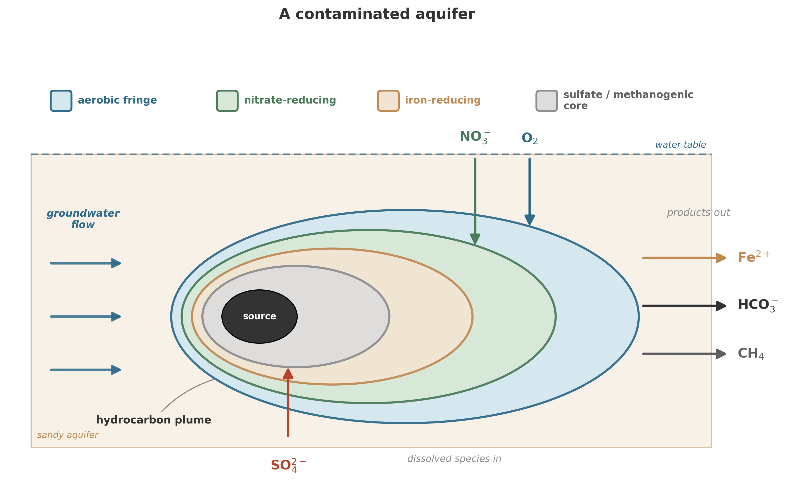

Groundwater contamination affects a large share of Chinese cities, and many northern urban systems still depend heavily on groundwater for municipal supply.[^zheng2016] That combination turns water quality into a national public-health problem.

The planet has the same amount of water it has always had. What we are running out of is *clean* water -- water whose chemistry is compatible with human life, agriculture, and the ecosystems we depend on. Philippe Van Cappellen, an ecohydrologist at the University of Waterloo who has spent decades studying how water moves through landscapes and what happens to contaminants along the way, puts it plainly: "Degradation of water quality is probably the most pervasive, global threat to human health and human prosperity."[^vancappellen2016]

And the irony, for a book that has spent nine chapters describing how microbes built and continue to operate the planet's chemical cycles, is this: the same microbial processes that shaped the atmosphere, cycled carbon through sediments, and maintained the redox structure of the deep subsurface are precisely the processes that can clean water. Or fail to, if we overwhelm them.

## The scale of the crisis

The problem is not confined to places with obvious industrial pressure. Canada, a country that most people associate with pristine wilderness and unlimited fresh water, carries its own version of the disease. Van Cappellen is blunt about this: there is a "perception that there is so much fresh water we don't need to worry."[^vancappellen2016] The perception is wrong. Canada may have access to as much as 20 percent of the world's stock of surface freshwater, but most Canadians live in the south, where only a minority of the country's renewable freshwater is found.[^canada_water] Water-quality pressures still accumulate where people, farms, and industry concentrate. Even Lake Erie -- the most studied body of fresh water on the continent -- harbors a surprise: the phosphorus fueling its algal blooms does not come only from rivers. Coastal bluffs erode into the lake, and decades-old sediments keep releasing phosphorus back into the water column. Together, these in-lake sources account for roughly a quarter of the total phosphorus budget.[^bocaniov2023]

The field that studies these problems has a name: ecohydrology. And it has undergone its own quiet revolution. Where it once focused on natural ecosystems -- how water moves through forests, wetlands, and pristine aquifers -- it has shifted to what Van Cappellen calls "socio-ecological systems where humans are an integral part." The pristine system is increasingly a fiction. Humans are not an external perturbation to the water cycle. We are in it, at every scale, from the nitrogen we spread on fields to the pharmaceuticals that pass through our bodies and into the sewage stream and on into rivers and groundwater.

## What microbes have to do with it

In Chapter 1, we described life as a non-equilibrium trick: organisms maintain chemical gradients by spending energy, continuously. In Chapters 2 through 7, we followed that logic as it shaped planets, metabolisms, microbial communities, and the merger that made eukaryotes possible. In Chapter 8, we turned those constraints into equations: conservation laws, transport operators, rate expressions. In Chapter 9, we asked how microbes "choose" among available reactions and showed that competition, thermodynamic constraints, and yield considerations produce predictable community structures.

All of that machinery -- every equation, every sidebar, every porewater profile -- describes what happens when organic matter and oxidants meet in the presence of microbial communities.

Water treatment is the same problem.

A contaminated aquifer is a reactor. The contaminants are electron donors or acceptors (or both). The indigenous microbial community is the catalyst. The question "Will this aquifer clean itself?" is the same question we have been asking about sediments since Chapter 8: What reactions are thermodynamically favorable? Are they kinetically accessible? Can transport deliver reactants and remove products fast enough to sustain the process? The same logic extends to the coast, where groundwater seeping through sediments into the ocean carries nutrient loads that in some regions rival what rivers deliver -- a hidden flux, underground and invisible, governed by the same redox reactions we have been studying throughout this book.[^slomp2004] Submarine groundwater discharge can contribute as much nitrogen and phosphorus to coastal zones as all riverine inputs combined in some regions.[^slomp2004_detail]

Van Cappellen sees this clearly: "Gaining understanding at a fundamental level on how natural processes eliminate contaminants from the environment can lead to development of new green technologies or engineered environments for water treatment and conservation."[^vancappellen2016]

The key phrase is "at a fundamental level." And here is the book's third claim, stated plainly: **water treatment underperforms when it ignores the geomicrobiology -- when the biology in the system is treated as a black box rather than a mechanism.**

The traditional engineering approach to water treatment works like this: characterize the contaminant, design a treatment system, specify operating parameters, build it, run it. The parameters are fixed. The biology is a black box -- you know bacteria are doing something in your bioreactor, but you do not model them as adaptive organisms with thermodynamic constraints. You model them as rate constants. Modern practice has moved well beyond this in many settings, but the black-box legacy persists in enough applications that the problem is real. When conditions change -- a new contaminant arrives, the temperature shifts, the redox environment evolves -- the model breaks, because the rate constants were calibrated for the old conditions and the black box has reorganized itself inside.

The geomicrobiology approach starts from the other end. It asks: what organisms are present? What reactions are thermodynamically favorable under local conditions? What are the kinetic constraints? How does the community adapt when conditions change? The biology is not a black box. It is the mechanism. And because the mechanism is understood -- because it rests on the same thermodynamic and kinetic principles we have been developing throughout this book -- the model can generalize. A model calibrated on one aquifer can make useful predictions for another, not because the organisms are the same, but because the constraints are the same.

The distinction determines whether your model works when conditions change, when the system is perturbed, when prediction matters.

And the payoff is not merely academic: "If we can increase the availability of clean water, we can automatically generate economic prosperity."[^vancappellen2016] This is the observation that water scarcity is a binding constraint on development in much of the world, and that relaxing that constraint has cascading effects on agriculture, industry, health, and political stability.

Canada, Van Cappellen argues, is uniquely positioned. It has both the water resources and the research community -- the people who understand the fundamental science -- to become a frontrunner in water technology. Whether it will is a different question, and one that depends on whether the science gets translated into engineering practice.

## The modeling challenge

The atmosphere can be modeled as a well-mixed box, but sediments and aquifers cannot. They have spatial structure -- gradients in concentration, redox zones, transport limitations. And that is where reaction-transport models -- RTMs -- become essential.

We built the mathematical machinery for RTMs in Chapter 8. The conservation equation, the transport operators, the rate expressions -- all of that was preparation for this. And water quality is perhaps the most consequential application of all.

The theoretical foundations were laid in the 1990s, when Van Cappellen and Wang showed that the full suite of redox reactions in surface sediments -- carbon, oxygen, nitrogen, sulfur, iron, manganese, all coupled -- could be captured in a single mathematical framework and used to reproduce the porewater profiles that geochemists actually measured.[^vancappellen1996] This breakthrough demonstrated that a mechanistic understanding of microbial metabolism, when embedded in a transport framework, could predict geochemical observations without fitting a separate rate constant for every measured profile.[^vancappellen1996_detail] Sandra Arndt and colleagues later put the case precisely: "RTMs are ideal diagnostic tools for diagenetic dynamics, as they explicitly represent coupling and interactions of processes."[^arndt2013_water] The key word is "coupling." In a real sediment or aquifer, nothing happens in isolation. Organic matter degradation produces CO$_2$ and consumes oxygen. When oxygen runs out, nitrate reduction begins, which produces N$_2$ and alters the pH. Sulfate reduction produces sulfide, which precipitates iron, which changes the availability of phosphorus. Every reaction is connected to every other reaction through the shared pool of chemical species.

{#fig-aquifer-rtm}

RTMs handle this coupling naturally. They solve the conservation equation for each species simultaneously, with transport (diffusion, advection, dispersion) and reaction (kinetic rate laws, thermodynamic constraints) woven together. The output is not a single number but a profile -- concentration as a function of space and time -- which can be compared directly to measurements.

RTMs become powerful diagnostic tools at this point. Given a measured porewater profile, an RTM can infer the biogeochemical reaction rates consistent with it, subject to the chosen model structure and assumptions.

But Arndt and colleagues are equally candid about the limitations: "The lack of mechanistic understanding of organic matter degradation is reflected in mathematical formulations used in RTMs."[^arndt2013_water] We know that organic matter is consumed. We can measure how fast. But the molecular-level mechanisms -- which enzymes attack which bonds, how microbial communities partition the work, what controls the apparent reactivity of organic matter as it ages -- remain incompletely understood. The rate laws we use in RTMs are effective descriptions, not fundamental ones.[^arndt2013_detail]

"Incorporating the complex interplay of different factors and proposing a consistent predictive algorithm represents a major challenge for future generations of RTMs."[^arndt2013_water] Arndt and colleagues state the problem cleanly. The framework works. Mechanistic understanding still lags. Modelers still need tighter links between microbiology, geochemistry, and transport physics than current rate laws can provide.

Modelers now work in a different tooling landscape. PHREEQC, EQ6, and the Geochemist's Workbench still matter, but many groups now build around interoperable and high-performance frameworks. PFLOTRAN and CrunchFlow are routinely coupled into larger multiphysics environments, and interfaces such as Alquimia were built to make that coupling systematic rather than improvised.[^molins2025] Machine-learning surrogates and physics-informed neural networks have started to compress some of the most expensive parts of the calculation, not by replacing conservation laws but by solving them faster.[^adhikari2026]

The need, in practical terms, is for better quantification of past, present, and future benthic carbon turnover. "Benthic" means "at the bottom" -- the sediment-water interface, the place where organic matter arrives and is processed. Getting the rates right at this interface determines whether we predict accurate fluxes of CO$_2$ and methane to the atmosphere, accurate nutrient recycling to the water column, and accurate contaminant attenuation in groundwater systems. The stakes are as high as the modeling is difficult.

## Fast reactions and slow reactions: the partial equilibrium trick

One of the practical challenges in building RTMs for water chemistry is the enormous range of reaction timescales. Aqueous reactions -- proton transfers, ion pairing, complexation -- happen in microseconds. Mineral dissolution and precipitation happen over days to years. Microbial metabolic reactions fall somewhere in between.

This spread of timescales creates a computational nightmare. If you try to solve all reactions kinetically -- writing an ODE for every species and every reaction -- you end up with a "stiff" system: some equations want to change on microsecond timescales while others evolve over years. Numerical solvers hate this. They either take absurdly small time steps (to resolve the fast reactions) or blow up (because the fast reactions are too stiff for the chosen step size).[^leal2015_stiff]

The solution is an idea borrowed from classical geochemistry: partial equilibrium.[^leal2015]

The core insight is simple. If some reactions are so fast that they reach equilibrium almost instantaneously, then we don't need to track their kinetics. We can replace their ODEs with algebraic constraints -- equilibrium expressions -- and solve only the slow reactions kinetically.

The mathematical details of the partial equilibrium approach -- the rate laws, the algebraic constraints, and the geochemical codes that implement them -- are collected in Appendix B (Section B.5). The intellectual lineage traces back to Helgeson (1968); modern codes including PHREEQC, EQ6, and the Geochemist's Workbench all exploit this same separation of timescales.[^leal2015]

The partial equilibrium approach is not just a computational convenience. It reflects a physical truth: the aqueous environment really does equilibrate much faster than the mineral surfaces that dissolve into it. The approximation works because the physics works.

For water treatment applications, this matters directly. When we model a treatment wetland, a permeable reactive barrier, or the natural attenuation of a contaminant plume, we need to get the aqueous chemistry right (pH, speciation, complexation) while tracking the slow reactions (mineral dissolution, microbial metabolism) that actually control contaminant fate. Partial equilibrium lets us do both without drowning in computational expense.

## The water-energy-carbon nexus

Water quality does not stand alone. Energy extraction contaminates water. Water treatment consumes energy. Organic carbon acts as contaminant and electron donor in many remediation settings. Shifts in rainfall and thaw change both the delivery of contaminants and the capacity of natural systems to process them.

The major greenhouse gases, CO$_2$, methane, and nitrous oxide, move through the same microbial machinery that governs water quality. Wetlands produce methane. Agricultural runoff drives nitrous oxide. The ocean absorbs CO$_2$ through gas exchange and carbonate chemistry, but biology shapes the net balance through photosynthesis, respiration, calcification, and remineralization.

Soil is the crowded interface in that story. Mineral surfaces, porewater, roots, fungi, bacteria, archaea, and viruses meet there. If you want to watch water, carbon, nutrients, and microbes push on one another at once, soil is the place to look.

Permafrost makes the link concrete. Permafrost soils hold an immense carbon reservoir, and the Arctic tundra has shifted from long-term sink to net source as warming, wildfire, and thaw expose organic matter to microbial attack.[^noaa2024] Isotope evidence points to microbial sources behind most of the methane surge from 2020 to 2022.[^michel2024] McGivern and colleagues showed that thaw also opens substrates once treated as protected: thawing-permafrost microbes can metabolize polyphenols that many carbon budgets had treated as slow or inert.[^northen2024] Urich and colleagues then showed why the story refuses a single slogan. Across the pan-Arctic, thaw does not hand victory to methanogens in every case. Drying can favor methanotrophs, while waterlogged thaw favors methane production.[^urich2025] Hydrology decides which guild wins.

Wetlands push the same chemistry into the open. Kuhn and colleagues estimate that boreal-Arctic wetlands and lakes emit about 34 teragrams of methane per year, with warming driving a steep rise through this century.[^kuhn2025] Lee and colleagues found the same logic in a brackish coastal wetland: warming speeds sulfate reduction, strips away the sulfate pool that feeds anaerobic methane oxidation, and tips the balance toward methane release.[^lee2025] One warming world produces both stories at once: more wet ground that feeds methanogens and weaker chemical buffers that once consumed part of their product.

Soils do not answer warming with one response. Sun and colleagues found that long-term warming cuts bacterial diversity and soil organic carbon on a global scale.[^sun2025] Liu and colleagues found a different response after a decade of warming in a subtropical forest: microbial networks reorganized, K-strategy taxa rose, and carbon-use efficiency stopped falling with temperature in the expected way.[^liu2025] Microbes can amplify warming in one soil and buffer it in another. A climate model that treats the soil community as a fixed rate constant misses that branch point.

The ocean pushes back in its own way. Lehmann and Bach report that reduced biotic calcification has left about 20 teramoles of extra alkalinity in surface waters over the past three decades, which increases CO$_2$ uptake by a modest amount.[^lehmannbach2025] That negative feedback helps. It does not erase the larger fact that climate, biology, and carbonate chemistry now move together.

An RTM for a contaminated aquifer and a global carbon cycle model share the same intellectual scaffolding: conservation equations, rate expressions, and the challenge of coupling fast and slow processes. The practical models differ in parameterization, spatial resolution, and biological detail. The logic is the same. In both cases, biology is the catalyst that makes thermodynamically favorable reactions happen on the timescales that matter.

The framework travels. Ground it in energy, transport, and kinetics, and it works in a sediment core, a treatment wetland, or a global climate model. The microbes change. The minerals change. The timescales change. The principles do not.

Tara Oceans turned that shared scaffold into a planetary map. Sunagawa and colleagues showed that temperature structures much of the upper-ocean microbiome and built a gene catalog large enough to treat marine microbial biogeography as Earth-system data rather than local anecdote.[^sunagawa2015] Viral ecology rides on that host landscape.

## The missing trophic layer: viruses

Viruses belong in the modern picture. Leave them out, and the biology looks cleaner than it is.

In the ocean, phages kill a substantial fraction of microbial cells each day, short-circuit the path from biomass to grazers, and send carbon back into dissolved pools. Suttle named that process the viral shunt.[^suttle2007] Talmy and colleagues make the modeling problem plain: planetary-scale ocean biogeochemical models still omit viral infection even though infection changes nutrient retention, carbon export, and primary production.[^talmy2025]

Viruses also change chemistry from inside the cell. Many carry auxiliary metabolic genes that alter host carbon, sulfur, or methane pathways during infection. Zhong and colleagues showed that viral genes with the potential to modulate methane metabolism are widespread and habitat-dependent.[^chen2024viral] Gilbert and colleagues then tied seasonal enhancement of the viral shunt to a subsurface oxygen maximum in the Sargasso Sea, linking viral lysis to oxygen structure rather than carbon recycling alone.[^gilbert2025]

Cold seeps push the same point into sediments. A 2025 survey of the Haima cold seep recovered 4,272 viral operational taxonomic units, most of them novel, with auxiliary metabolic genes tied to carbon and sulfur cycling across seep development.[^haima2025] Soils pose the same problem on land. Hazard and colleagues identify the missing infection-rate and host-range measurements that keep soil viruses out of most carbon and nitrogen budgets, even though the ecological case for including them keeps growing.[^hazard2025]

Microbes do not run the planet alone. Their parasites redirect carbon, reshape oxygen profiles, move genes, and alter which metabolisms dominate. A biogeochemical model that omits viruses does not simplify the system. It drops a trophic layer.

## What the microbes are still doing

You could treat microbes as abstract reaction catalysts -- black boxes that convert inputs to outputs according to rate laws. That reduction would break the argument of this book, so it is worth stating the problem one more time.

Microbes are not passive. They respond to their environment. They regulate gene expression, adjust their metabolic machinery, form communities with complementary capabilities, and compete for shared resources. The "choices" they make -- which we showed in the preceding chapters are better described as emergent consequences of thermodynamic and kinetic constraints -- determine which reactions dominate in a given environment.

In a contaminated aquifer, this means that the microbial community is not a fixed parameter. It adapts. Introduce a new electron donor (a hydrocarbon plume, for instance), and the community restructures around it. Remove the donor, and the community shifts again. The timescale of this restructuring -- days to months for metabolic switching, months to years for community composition changes -- is comparable to the timescales of contaminant transport, which means biology and transport are coupled, not independent.

This coupling is what makes prediction hard and what makes understanding essential. A model that treats the microbial community as fixed will get the short-term dynamics right (maybe) but miss the long-term trajectory. A model that allows the community to adapt -- that includes the thermodynamic and kinetic constraints on microbial metabolism we developed in the preceding chapters -- has a chance of capturing both.

We are not there yet. As Arndt and colleagues noted, the mechanistic understanding is incomplete. But the direction is clear, and the stakes are high.

## Canada's opportunity

Van Cappellen's argument about Canada is worth pausing on, because it illustrates how basic science connects to practical outcomes.

Canada may have access to as much as 20% of the world's stock of surface freshwater, though its renewable supply is much smaller and geographically uneven.[^canada_water] It has a large and active water research community -- universities, government laboratories, environmental consultancies. And it faces water quality challenges that, while less dramatic than China's in scale, are serious and growing: agricultural contamination, legacy industrial contamination, and emerging contaminants (pharmaceuticals, microplastics, PFAS).

But the real story is not national self-congratulation. Canada is one node in a much larger network of hydrogeologists, geomicrobiologists, modelers, and environmental engineers working on the same coupled problems in the Netherlands, Germany, China, Scandinavia, the United States, and many other places. Waterloo matters here because it is a useful vantage point, not because the science stops at its borders.

The scientific tools to address these challenges exist. RTMs can predict contaminant fate. Microbial ecology can identify the organisms doing the work. Geochemistry can characterize the reactions. Isotope proxies can track the sources.

What is often missing is the integration -- the step from understanding individual processes to predicting whole-system behavior. That integration is exactly what RTMs are designed to provide, and it is the integration step that makes RTMs useful.

"If we can increase the availability of clean water, we can automatically generate economic prosperity."[^vancappellen2016] Van Cappellen's statement is simple, but the science behind it is not. It requires understanding microbial metabolism (Chapters 3--5), formulating it mathematically (Chapter 8), predicting community behavior (Chapter 9), and applying the models to real systems (this chapter). The chain from fundamental science to societal benefit is long, but every link is necessary.

## The 4.5-billion-year operating manual

We began this book with a bacterium dividing once per century, 2.8 kilometers underground, on an energy budget thinner than a candle flame. That organism -- *Candidatus* Desulforudis audaxviator -- was not a curiosity. It was an existence proof: life is a non-equilibrium system, maintained by microbial metabolism, visible as gradients in chemistry.

Since then, we have traveled from the quantum-mechanical basis of redox reactions to the planetary-scale cycling of carbon, nitrogen, and sulfur. We have built a mathematical framework -- conservation equations, transport operators, rate laws, thermodynamic constraints -- that can describe what happens in a porewater profile, a treatment wetland, or the global ocean. We have met the organisms that do the work: methanogens in the deep subsurface, sulfate reducers at the sulfate-methane transition, iron reducers in aquifer sediments, nitrifiers and denitrifiers in soils and treatment systems.

The story has a single through-line: **life is a way of harvesting chemical gradients, and the harvesting reshapes the gradients, which reshapes the opportunities for life.**

The feedback loop has been running for at least 3.8 billion years. It oxygenated the atmosphere. It drew down CO$_2$ through weathering and biological sequestration, and released it through degassing and organic matter oxidation. It created the redox structure of sediments and soils. It still operates in every aquifer, every ocean margin, every wetland, every wastewater treatment plant.

The 4.5-billion-year story we have told is not just history. It is the operating manual for the planet we live on.

The microbes that built this world are still running it. They are central to Earth's carbon cycle[^wehrli2013] and participate in the cycling of nitrogen, sulfur, and most other biologically active elements. The deep subsurface biosphere alone may harbor several billion tons of carbon in microbial biomass -- a hidden world operating on geological timescales.[^magnabosco2018_water] They operate in the dark, in the cold, in conditions that would kill anything larger. And they respond to thermodynamic and kinetic constraints with a precision that, once you learn to read it, looks almost like engineering.

Understanding them is not optional. It is not a curiosity for specialists. It is essential -- for predicting climate, for managing water, for designing treatment systems that work with biology rather than against it.

The bacterium is still down there, still dividing, still confessing what life really requires. The question is whether we are listening.

## Takeaway

- Degradation of water quality is among the most pervasive global threats to human health and prosperity, affecting both developing nations (China's groundwater crisis) and wealthy ones (Canada's complacency about contamination).
- The microbial processes that shaped Earth's atmosphere and sediment chemistry over billions of years are among the processes that can clean contaminated water -- if we understand them well enough.
- The greenhouse gases that drive climate change -- CO$_2$, CH$_4$, N$_2$O -- are connected to water quality through shared biogeochemistry. Permafrost, wetlands, soils, and the surface ocean all turn microbial ecology into climate feedback.
- Reaction-transport models bridge the gap between mechanistic understanding and system-level prediction, but require better integration of microbial ecology and organic matter chemistry to fulfill their potential.
- Modern biogeochemical modeling is moving toward interoperable solver ecosystems, ML-assisted surrogates, and explicit treatment of overlooked biological actors such as viruses, which many planetary models still omit.
- The partial equilibrium approach -- treating fast aqueous reactions as algebraic constraints while solving slow mineral reactions kinetically -- is a practical computational strategy with deep physical justification.

[^arndt2013_water]: Sandra Arndt et al., "Quantifying the Degradation of Organic Matter in Marine Sediments: A Review and Synthesis," *Earth-Science Reviews* 123 (2013): 53--86. [@Arndt2013]

[^leal2015]: A. M. M. Leal, M. J. Blunt, and T. C. LaForce, "A Chemical Kinetics Algorithm for Geochemical Modelling," *Applied Geochemistry* (2015). [@Leal2015]

[^bocaniov2023]: S. A. Bocaniov, D. Scavia, and P. Van Cappellen, "Long-Term Phosphorus Mass-Balance of Lake Erie (Canada-USA) Reveals a Major Contribution of In-Lake Phosphorus Loading," *Ecological Informatics* 77 (2023): 102131. [@Bocaniov2023]

[^slomp2004]: C. P. Slomp and P. Van Cappellen, "Nutrient Inputs to the Coastal Ocean through Submarine Groundwater Discharge: Controls and Potential Impact," *Journal of Hydrology* 295 (2004): 64--86. [@Slomp2004]

[^vancappellen1996]: P. Van Cappellen and Y. Wang, "Cycling of Iron and Manganese in Surface Sediments: A General Theory for the Coupled Transport and Reaction of Carbon, Oxygen, Nitrogen, Sulfur, Iron, and Manganese," *American Journal of Science* 296 (1996): 197--243. [@VanCappellen1996]

[^zheng2016]: Chunmiao Zheng et al., "Towards Integrated Groundwater Management in China," in *Integrated Groundwater Management: Concepts, Approaches and Challenges*, ed. A. J. Jakeman et al. (Springer, 2016), 455--475. Zheng et al. review China's groundwater-management challenge, emphasizing both heavy urban dependence on groundwater -- especially in the north -- and widespread contamination documented by national monitoring programs. [@Zheng2016]

[^vancappellen2016]: Philippe Van Cappellen, interview with Research2Reality, "Clean Water Knows No Boundaries" (2016). All Van Cappellen quotes in this chapter are from this interview and related public lectures at the University of Waterloo. [@VanCappellen2016interview]

[^wehrli2013]: Bernhard Wehrli, "Biogeochemistry: Conduits of the carbon cycle," *Nature* 503 (2013): 346--347. [@Wehrli:2013fv]

[^canada_water]: Statistics Canada, *Freshwater Supply and Demand in Canada* (2010). Statistics Canada notes that Canada may have access to as much as 20% of the world's stock of surface freshwater, but that 98% of Canadians live in the south, which accounts for only 38% of the country's renewable freshwater. [@StatsCan2010Water]

[^slomp2004_detail]: Caroline P. Slomp and Philippe Van Cappellen, "Nutrient inputs to the coastal ocean through submarine groundwater discharge: Controls and potential impact," *Journal of Hydrology* 295 (2004): 64--86. Submarine groundwater discharge is now recognized as a major, previously underappreciated pathway for delivering nutrients and contaminants to coastal waters. [@Slomp2004]

[^vancappellen1996_detail]: Philippe Van Cappellen and Yifeng Wang, "Cycling of iron and manganese in surface sediments: A general theory for the coupled transport and reaction of carbon, oxygen, nitrogen, sulfur, iron, and manganese," *American Journal of Science* 296 (1996): 197--243. This paper established the template for mechanistic reaction-transport modeling of early diagenesis. [@VanCappellen1996]

[^arndt2013_detail]: Sandra Arndt et al., "Quantifying the Degradation of Organic Matter in Marine Sediments: A Review and Synthesis," *Earth-Science Reviews* 123 (2013): 53--86. Comprehensive review of organic matter degradation kinetics and the challenges of parameterizing reactivity in sediment models. [@Arndt2013]

[^leal2015_stiff]: Allan M. M. Leal, Martin J. Blunt, and Tara C. LaForce, "A chemical kinetics algorithm for geochemical modelling," *Applied Geochemistry* 55 (2015): 46--61. [@Leal2015]

[^magnabosco2018_water]: Cara Magnabosco et al., "The biomass and biodiversity of the continental subsurface," *Nature Geoscience* 11 (2018): 707--717. [@Magnabosco2018]

[^molins2025]: Sergi Molins et al., "Alquimia v1.0: a generic interface to biogeochemical codes - a tool for interoperable development, prototyping and benchmarking for multiphysics simulators," *Geoscientific Model Development* 18 (2025): 3241--3263. Alquimia was designed to let multiphysics codes use mature geochemical engines without bespoke rewrites for every coupling. [@Molins2025]

[^adhikari2026]: Kripa Adhikari et al., "Reactive transport modeling with physics-informed machine learning for critical minerals applications," *Transport in Porous Media* 153 (2026): 45. A recent example of physics-informed machine learning being used to accelerate reactive-transport calculations rather than replace their governing equations. [@Adhikari2026]

[^noaa2024]: Twila A. Moon, Matthew L. Druckenmiller, and Rick L. Thoman, eds., *Arctic Report Card 2024* (NOAA, 2024). The report documents the Arctic tundra's transition from long-term carbon sink to net source. [@ArcticReportCard2024]

[^michel2024]: Sylvia Michel, Xin Lan, and colleagues, "Rapid shift in methane carbon isotopes suggests microbial emissions drove record high atmospheric methane growth in 2020-2022," *PNAS* 121 (2024). The isotopic evidence points strongly toward microbial sources behind the recent methane surge. [@Michel2024]

[^northen2024]: Bridget B. McGivern et al., "Microbial polyphenol metabolism is part of the thawing permafrost carbon cycle," *Nature Microbiology* 9 (2024): 1454--1466. The study weakens the idea that polyphenols remain largely protected during thaw and strengthens the case for larger microbial carbon losses. [@McGivern2024]

[^suttle2007]: Curtis A. Suttle, "Marine viruses - major players in the global ecosystem," *Nature Reviews Microbiology* 5 (2007): 801--812. A classic review of the viral shunt and the scale at which marine viruses regulate microbial mortality and carbon recycling. [@Suttle2007]

[^chen2024viral]: Zhi-Ping Zhong et al., "Viral potential to modulate microbial methane metabolism varies by habitat," *Nature Communications* (2024). Viral auxiliary metabolic genes affecting methane pathways are widespread enough to matter for how we think about microbial greenhouse-gas budgets. [@Zhong2024]

[^urich2025]: Tim Urich and others, "Methane-cycling microbiomes in soils of the pan-Arctic and their response to permafrost degradation," *Communications Earth & Environment* 6 (2025). Urich and colleagues show that thaw response depends on which methane-cycling guilds take over under wet versus dry post-thaw conditions. [@Urich2025]

[^kuhn2025]: McKenzie Kuhn and others, "Current and future methane emissions from boreal-Arctic wetlands and lakes," *Nature Climate Change* 15 (2025): 986--995. Kuhn and colleagues estimate the present methane budget of boreal-Arctic wetlands and lakes and project a strong warming-driven rise. [@Kuhn2025]

[^lee2025]: Jaehyun Lee, Yerang Yang, Hojeong Kang, Genevieve L. Noyce, and J. Patrick Megonigal, "Climate-induced shifts in sulfate dynamics regulate anaerobic methane oxidation in a coastal wetland," *Science Advances* 11 (2025). Lee and colleagues show how warming weakens sulfate-dependent methane consumption in a brackish wetland. [@Lee2025]

[^sun2025]: Yuan Sun, Han Y. H. Chen, Xin Chen, Masumi Hisano, Xinli Chen, and Peter B. Reich, "Rising global temperatures reduce soil microbial diversity over the long term," *PNAS* 122 (2025). Sun and colleagues link long-term warming to declines in microbial diversity and soil organic carbon. [@Sun2025]

[^liu2025]: Juxiu Liu and others, "Robust microbial interactions, not diversity, dominate metabolic thermal adjustment following decadal warming in a subtropical forest," *Science Advances* 11 (2025). Liu and colleagues show that long warming can reorganize microbial networks and change carbon-use efficiency rather than driving a single fixed response. [@Liu2025]

[^lehmannbach2025]: N. Lehmann and L. T. Bach, "Global carbonate chemistry gradients reveal a negative feedback on ocean alkalinity enhancement," *Nature Geoscience* 18 (2025). Lehmann and Bach identify a surface-ocean alkalinity increase tied to reduced biotic calcification under acidification. [@LehmannBach2025]

[^sunagawa2015]: Sunagawa and colleagues, "Structure and function of the global ocean microbiome," *Science* 348 (2015). The Tara Oceans synthesis showed that temperature structures much of the upper-ocean microbiome and established a global microbial gene catalog. [@Sunagawa2015]

[^talmy2025]: David Talmy, Cristina Howard-Varona, Damien Eveillard, Markus Covert, and Matthew B. Sullivan, "Viruses in multi-scale ocean models: challenges and opportunities," *Frontiers in Marine Science* 12 (2025). Talmy and colleagues argue that marine biogeochemical models still omit viruses despite their impact on primary production and elemental flux. [@Talmy2025]

[^gilbert2025]: Naomi E. Gilbert and others, "Seasonal enhancement of the viral shunt catalyzes a subsurface oxygen maximum in the Sargasso Sea," *Nature Communications* 16 (2025). Gilbert and colleagues link viral lysis to oxygen structure in the oligotrophic ocean. [@Gilbert2025]

[^haima2025]: A 2025 Haima cold seep viral survey recovered 4,272 viral operational taxonomic units and showed that many carry auxiliary metabolic genes tied to carbon and sulfur cycling across seep development. [@HaimaColdSeep2025]

[^hazard2025]: Catherine Hazard, Karthik Anantharaman, Lauren S. Hillary, Umberto Neri, Simon Roux, Gabrielle Trubl, Kristin Williamson, Jennifer Pett-Ridge, Graeme W. Nicol, and Joanne B. Emerson, "Beneath the surface: Unsolved questions in soil virus ecology," *Soil Biology and Biochemistry* 205 (2025): 109780. Hazard and colleagues map the main measurement gaps that keep soil viruses out of many biogeochemical budgets. [@Hazard2025]
